# MindAi

MindAi turns a plain-language question into a MongoDB query and a finished answer — a dashboard of charts, a written report, or a one-line factual answer. Someone (a user, or another system) asks *"top 5 projects by budget"*, and the backend figures out which collection to query, builds and runs a MongoDB aggregation pipeline, and formats the result. No manual query-building, no fixed report templates, no hardcoded chart types.

> **Active codebase — read this first.** The real, running application is **[`nest-app/`](nest-app/)** (NestJS API) and **[`client/`](client/)** (Angular UI). The `src/` folder at the repo root is an earlier standalone Mastra/Express prototype and **is not used** — do not build on it, and do not trust `ARCHITECTURE.md`, `HOW_IT_WORKS.md`, or `PROJECT_WORKFLOW_REPORT.md` at the repo root, which document that old prototype (different framework, different file layout, different LLM provider). This README describes the current system end-to-end and supersedes those three files.

## For Managers & Non-Technical Stakeholders

**What it is, in plain terms:** MindAi is a chat-style interface to a database. Instead of a developer writing a query and a chart by hand, a person types a question in English (or Arabic — the writer skill explicitly supports both), and the system produces a chart, a written report, or a direct answer within a few seconds. It works against whatever MongoDB collections the team registers as "data sources" — it does not need to be re-coded for each new dataset.

**How it makes decisions:** Every answer is generated by an external AI provider (OpenAI, Anthropic/Claude, Google Gemini, Groq, or a few others) that the team configures — either one API key per user, or a small shared pool of keys the whole team draws from. There is no in-house model; MindAi is an orchestration layer that turns a question into the right calls to (a) that AI provider and (b) MongoDB.

**What it costs to run:** Every question costs **two AI calls** (one to plan the database query, one to write the final answer) — cheaper when a follow-up question can reuse the previous plan, and free (zero AI calls) when an identical question was asked in the last 7 days and the result is still cached. Token usage per user/connection is tracked automatically ([§8](#8-api-reference) `GET /api/settings`, [§7](#7-data-model--mongodb-collections) `agent_config`) so cost is attributable.

**What's solid vs. what to know before relying on it further:**
- ✅ Core query→answer pipeline, retry-on-failure for both the database query and the AI provider, dashboards/reports/inquiries, conversation follow-ups, per-user settings.
- ⚠️ **Authentication is intentionally minimal today** — see [§15](#15-security-model--trust-boundaries). It is fine for an internal tool with trusted users; it is not yet a multi-tenant SaaS-grade access control system. Anyone planning to expose this outside a trusted network should read that section first.
- ⚠️ No built-in cost caps beyond per-connection token limits — a misbehaving prompt loop could still run up provider bills if nothing stops it upstream.
- See [§23](#23-known-limitations--roadmap-considerations) for the full, specific list of gaps and rough-edges an engineering roadmap would want to address.

Everything below this point is written for engineers, but nothing above it requires reading the code.

## Quick Reference

| | |
|---|---|
| **Backend** | `nest-app/` — NestJS 11 + Mongoose, port `3000` |
| **Frontend** | `client/` — Angular 21, proxies to the backend in dev |
| **Primary datastore** | MongoDB (data sources, cache, history, settings, memory, agents) |
| **Conversation memory** | LibSQL/SQLite file at `./data/memory.db` |
| **Main endpoint** | `POST /api/analytics` — `{ prompt, intent?, sessionId? }` |
| **LLM calls per request** | 2 (planner + writer/chart), 0 on a cache hit |
| **Supported LLM providers** | OpenAI, Anthropic, Google Gemini, Groq, Mistral, Together, Perplexity |
| **Auth model** | Optional shared `x-api-key`; per-request `x-user-id` is **not verified** (see [§15](#15-security-model--trust-boundaries)) |
| **Run backend** | `cd nest-app && npm run start:dev` |
| **Run frontend** | `cd client && npm start` |
| **Run backend tests** | `cd nest-app && npm run test` |

## Table of Contents

1. [What It Does](#1-what-it-does)
2. [Repository Layout](#2-repository-layout)
3. [Tech Stack](#3-tech-stack)
4. [Architecture](#4-architecture) — system context, module graph, request lifecycle, sequence diagrams, access-resolution & agent state flowcharts
5. [Backend Modules (nest-app/src)](#5-backend-modules-nest-appsrc)
6. [AI Pipeline in Detail](#6-ai-pipeline-in-detail)
7. [Data Model — MongoDB Collections](#7-data-model--mongodb-collections)
8. [API Reference](#8-api-reference)
9. [Examples — Prompts, Requests & Responses](#9-examples--prompts-requests--responses)
10. [Frontend (client/)](#10-frontend-client)
11. [Getting Started](#11-getting-started)
12. [Configuration Reference](#12-configuration-reference)
13. [Error Handling & Resilience](#13-error-handling--resilience)
14. [Testing](#14-testing)
15. [Security Model & Trust Boundaries](#15-security-model--trust-boundaries)
16. [Background Jobs](#16-background-jobs)
17. [Logging & Observability](#17-logging--observability)
18. [Deployment](#18-deployment)
19. [Error Response Format](#19-error-response-format)
20. [Common Workflows](#20-common-workflows)
21. [Glossary](#21-glossary)
22. [Troubleshooting](#22-troubleshooting)
23. [Known Limitations & Roadmap Considerations](#23-known-limitations--roadmap-considerations)
24. [Contributing](#24-contributing)

---

## 1. What It Does

A client sends a natural-language prompt to `POST /api/analytics`. The backend classifies (or is told) the **intent** and returns one of three shapes:

| Intent | Output type | Example prompt | What comes back |
|---|---|---|---|
| `dashboard` | `DashboardSpec` | *"show projects by status"* | One or more ECharts-ready chart widgets + a title/summary |
| `report` | `ReportResult` | *"analyze infrastructure projects"* | 1–5 narrative sections (`{ heading, body }`), optionally with a chart |
| `inquiry` | `InquiryResult` | *"how many projects are active?"* | A short factual `summary` string |

If `intent` is omitted, the same pipeline is still run generically (`PipelineService.execute()`) and dispatches based on whatever skills the planner decided the prompt needs.

Everything is driven by **data sources** registered at runtime (`POST /api/sources`): a MongoDB collection plus a field schema (name, type, role, enum values, references to other sources). The LLM is only ever shown field names that exist in a registered source's schema, and any pipeline stage referencing an unregistered field is rejected before it ever reaches MongoDB — this is the single biggest design decision in the codebase, because it turns "LLM hallucinates a field name" from a runtime bug into a caught, retryable validation error.

Full worked examples of every intent — request bodies and complete JSON responses, including real ECharts chart options — are in [§9](#9-examples--prompts-requests--responses).

## 2. Repository Layout

```
MindAi/
├── nest-app/                    ← THE BACKEND (NestJS + MongoDB). All backend work happens here.
│   ├── src/
│   │   ├── ai/                  ← LLM orchestration: planner, chart builder, writer, model client
│   │   │   ├── model.ts             resolveModel(), provider adapters, rate-limit retry
│   │   │   ├── planner.ts           LLM call #1 — builds the MongoDB pipeline (TaskPlan)
│   │   │   ├── chart.ts             LLM call #2 (dashboard) — builds DashboardSpec widgets
│   │   │   ├── writer.ts            LLM call #2 (report/inquiry) — narrative output
│   │   │   ├── memory-skill.ts      extracts long-term memories from a finished turn
│   │   │   ├── skill-prompt.ts      loads prompt sections from skills/*/SKILL.md
│   │   │   ├── token.ts             TokenUsage add/zero helpers
│   │   │   └── chart-results.repository.ts   audit log of generated dashboards
│   │   ├── analytics/            ← top-level orchestration
│   │   │   ├── analytics.controller.ts   POST /api/analytics, GET /api/provider
│   │   │   ├── analytics.service.ts      access resolution, session/memory, error classification
│   │   │   └── pipeline.service.ts       plan → validate → execute → dispatch skill
│   │   ├── sources/               ← registered dataset schemas (Mongo-backed, cached in memory)
│   │   ├── history/                ← past pipeline runs + conversation sessions
│   │   ├── cache/                  ← prompt→result cache (MongoDB, 7-day TTL)
│   │   ├── saved-results/          ← user-pinned dashboards/reports/inquiries
│   │   ├── user-settings/          ← per-user "bring your own API key" config
│   │   ├── agent-config/           ← shared/fallback AI connections ("agents") + health checks
│   │   ├── memory/                 ← long-term per-user memory extraction (opt-in)
│   │   ├── session/memory.ts       ← LibSQL-backed conversation memory (short-term, per session)
│   │   ├── config/configuration.ts ← typed env var loader
│   │   ├── common/                 ← guards, filters, middleware, logger, helpers
│   │   ├── types/index.ts          ← shared TypeScript interfaces (DataSource, TaskPlan, DashboardSpec…)
│   │   ├── prompts/index.ts        ← builds inquiry/report/chart user messages from rows
│   │   ├── app.module.ts           ← wires every module, Mongo connection, static Angular serving
│   │   └── main.ts                 ← bootstrap: helmet, CORS, validation pipe, shutdown hooks
│   └── test/                      ← e2e tests (Jest)
│
├── client/                      ← THE FRONTEND (Angular 21 + ECharts + Tailwind)
│   └── src/app/                 ← flat, single-view SPA (see §10)
│
├── skills/                      ← Markdown "skill" prompt files consumed by nest-app/src/ai
│   │                            ← 5 of 8 folders are actually loaded (verified via `skillFile()` call sites) — see §6
│   ├── aggregation/SKILL.md         ACTIVE — planner system prompt + pipeline-stage semantics config
│   ├── chart/SKILL.md               ACTIVE — chart-widget system prompt (full ECharts authoring contract)
│   ├── report/SKILL.md, inquiry/SKILL.md   ACTIVE — writer system prompts (loaded by ai/writer.ts)
│   ├── memory/SKILL.md              ACTIVE — memory-extraction system prompt
│   ├── writer/SKILL.md              DEAD — no `skillFile('writer', ...)` call anywhere; not loaded
│   ├── analytics/SKILL.md           DEAD — not loaded
│   └── suggestions/SKILL.md         DEAD — not loaded
│
├── src/                         ← LEGACY prototype (Mastra + Express). Not used — do not build on this.
├── ARCHITECTURE.md, HOW_IT_WORKS.md, PROJECT_WORKFLOW_REPORT.md
│                                ← LEGACY docs describing the src/ prototype above. Superseded by this README.
│
├── data/                        ← local SQLite (LibSQL) memory store, gitignored
└── scripts/                     ← seed/reset scripts for the legacy prototype only
```

## 3. Tech Stack

| Layer | Technology | Notes |
|---|---|---|
| Backend framework | NestJS 11 (Express platform) | Modules per feature area; see [`nest-app/package.json`](nest-app/package.json) |
| Database | MongoDB via Mongoose (`@nestjs/mongoose`) | One connection; every module injects its own model |
| Conversation memory | `@mastra/memory` + `@mastra/libsql` | Local SQLite file, `./data/memory.db` — the only piece of the old Mastra stack still in active use |
| LLM access | Vercel AI SDK (`ai`) + `@mastra/core` `Agent` | One `Agent` instance created per call, per role (`supervisor`, `writer`, `chart`, `memory`) |
| Provider adapters | `@ai-sdk/openai`, `@ai-sdk/anthropic`, `@ai-sdk/google`, `@ai-sdk/groq` | Mistral / Together / Perplexity ride the OpenAI-compatible adapter with a custom `fetch` |
| Structured LLM output | `zod` schemas passed as `structuredOutput` on every agent call | Guarantees the shape of `TaskPlan`, `DashboardSpec`, report sections, etc. |
| Charting | ECharts, authored directly by the chart LLM (see [§6](#6-ai-pipeline-in-detail) and [§9](#9-examples--prompts-requests--responses)) | The model designs the full `option` object; the runtime only sanitizes and injects live row data |
| Validation | `class-validator` / `class-transformer` | Applied globally via `ValidationPipe({ whitelist: true, transform: true })` |
| Scheduling | `@nestjs/schedule` | Two cron jobs in `agent-config` (see [§16](#16-background-jobs)) |
| Logging | Custom colored console logger + `AsyncLocalStorage` request IDs | See [§17](#17-logging--observability) |
| API documentation | `@nestjs/swagger` — live OpenAPI UI at `/api/docs`, raw spec at `/api/docs-json` | Generated from `class-validator` DTOs via the `@nestjs/swagger` Nest CLI plugin (`nest-cli.json`); disable with `DISABLE_SWAGGER=true` |
| Security | `helmet`, optional `x-api-key` guard, CORS allow-list | See [§15](#15-security-model--trust-boundaries) for the gaps |
| Frontend | Angular 21 (standalone components, no NgModules) | Tailwind CSS for styling, ECharts for rendering |

## 4. Architecture

This section is the single place meant to bring a new team member — engineer or not — to a working mental model of the whole system: who talks to whom, in what order, under what failure modes, and where the state lives. Read it top to bottom the first time; use it as a reference afterward.

### 4.1 System Context — who talks to whom

The outermost view: the actors around the system and the external services it depends on. Nothing here is internal implementation — just the boundary of the system and what crosses it.

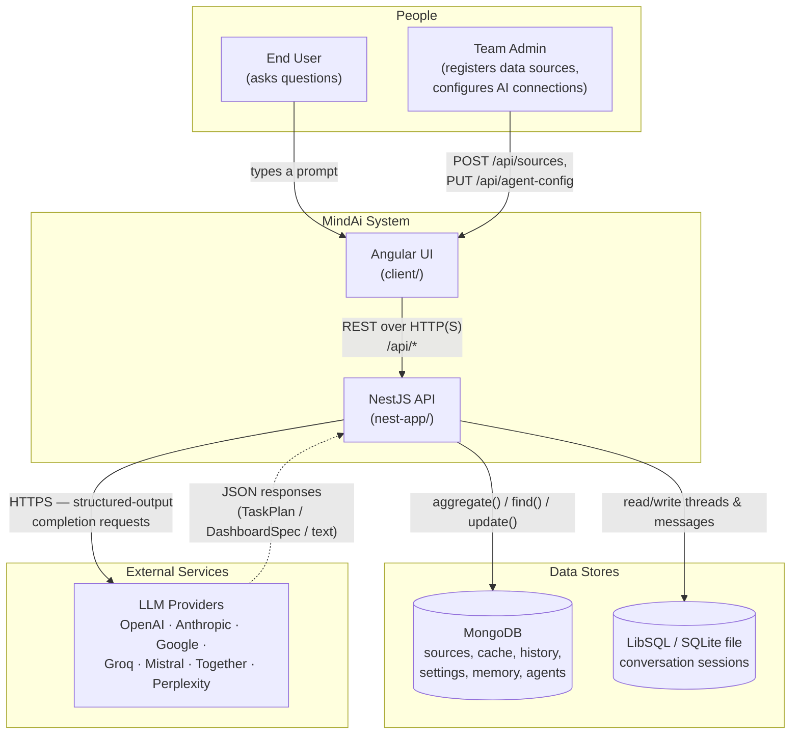

**Reading this diagram:** everything the system *decides* (which fields to query, what chart to draw, what the report says) is produced by the boxed **LLM Providers** — MindAi itself contributes no model, only orchestration, validation, and safety rails around those external calls. Both data stores are owned and run by the team (MongoDB for almost everything durable, a small local SQLite file only for short-term conversation memory) — no data leaves the system except the prompt/schema/row-sample text sent to whichever LLM provider is configured.

### 4.2 Component Architecture — inside the NestJS process

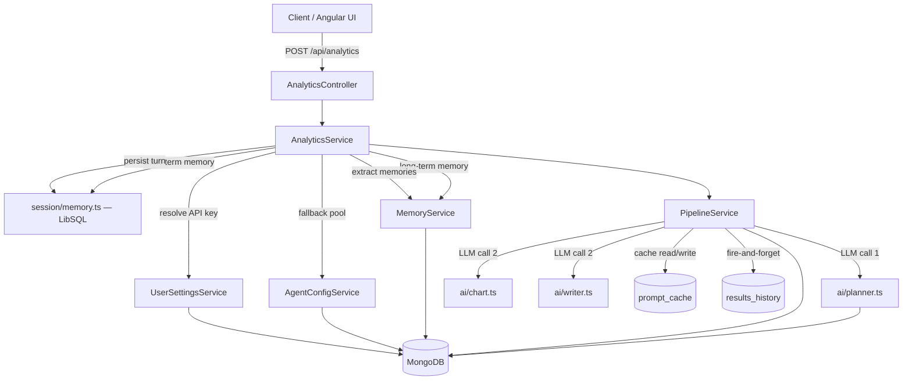

### 4.3 NestJS Module Dependency Graph

What actually imports what, straight from every `*.module.ts` — useful when deciding where a new feature belongs or what a change might ripple into.

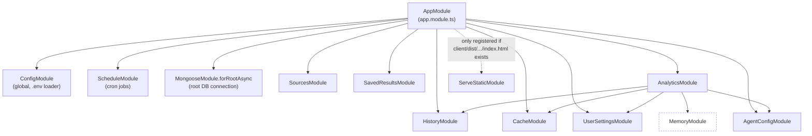

**Notable, easy-to-miss detail:** `MemoryModule` is **not** imported directly by `AppModule` — it's only reachable through `AnalyticsModule`. Every other feature module (`SourcesModule`, `HistoryModule`, `CacheModule`, `SavedResultsModule`, `UserSettingsModule`, `AgentConfigModule`) is self-contained: no feature module imports another feature module except `AnalyticsModule`, which is the one place that composes everything else into a single request flow. `SourcesModule` and `SavedResultsModule` are the only two modules with **no** module-to-module dependencies at all — they only depend on their own Mongoose model.

### 4.4 Request Lifecycle — middleware, guards, and pipes in order

The exact order every incoming HTTP request passes through, from `main.ts` bootstrap and `AppModule.configure()`:

```mermaid
flowchart LR
    Req["Incoming HTTP request"] --> Helmet["helmet()\nsecurity headers\n(CSP disabled)"]
    Helmet --> CORS["CORS check\nALLOWED_ORIGINS allow-list\nor allow-all if unset"]
    CORS --> ReqId["RequestIdMiddleware\napplies to '*' routes —\nassigns a UUID via\nAsyncLocalStorage"]
    ReqId --> Guard["ApiKeyGuard (APP_GUARD)\nchecks x-api-key\nonly if API_KEY env is set;\nskips /health, /api/meta,\n/api/provider, /api/key*"]
    Guard --> Pipe["ValidationPipe\nwhitelist:true, transform:true\n— strips unknown fields,\nruns class-validator"]
    Pipe --> Ctrl["Route Controller"]
    Ctrl --> Svc["Service / business logic"]
    Svc -->|throws| Filter["AllExceptionsFilter (APP_FILTER)\nnormalizes every error to\n{ error, code?, ...extra }"]
    Svc -->|resolves| Res["JSON response"]
    Filter --> Res
```

A request that fails the `ApiKeyGuard` or `ValidationPipe` never reaches a controller method at all — both are registered globally (`APP_GUARD` in `app.module.ts`, `ValidationPipe` in `main.ts`), so every route gets the same treatment without each controller repeating the logic.

### 4.5 Request Sequences by Intent

The three concrete request flows a `POST /api/analytics` call can take, depending on `intent` and whether the prompt cache has a hit.

#### Dashboard, cache miss

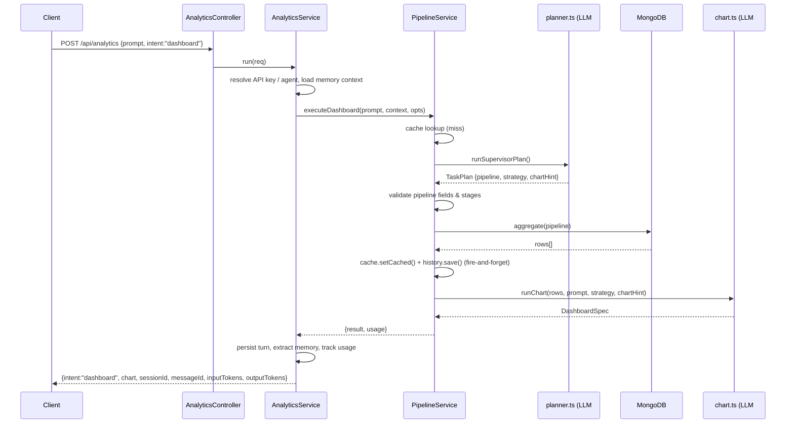

#### Report, with chart

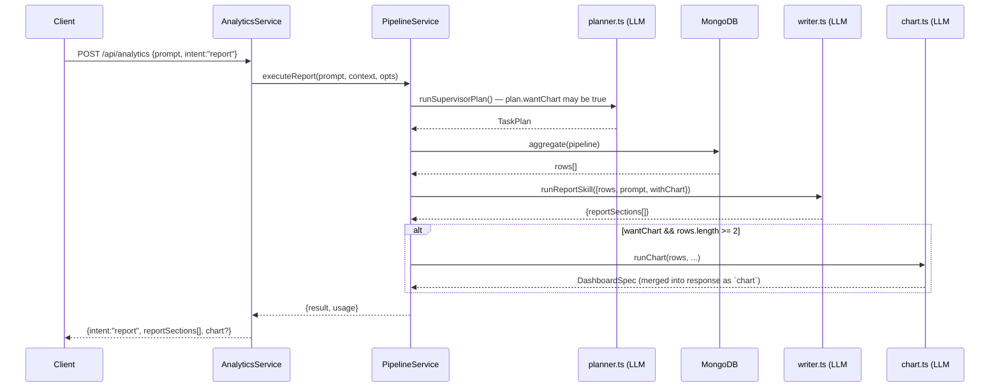

#### Inquiry, prompt-cache hit

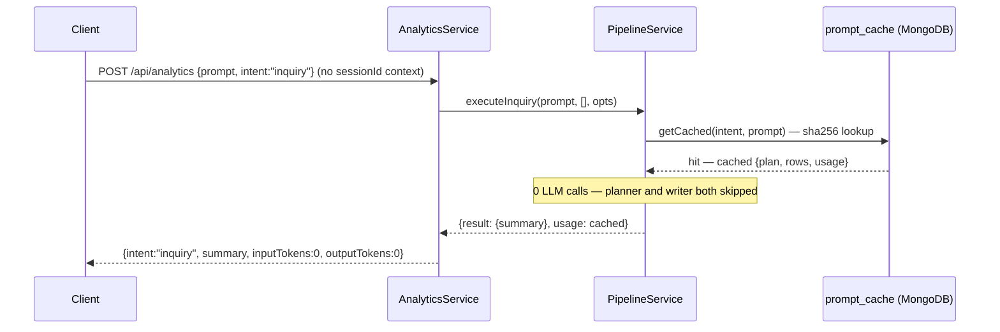

Two LLM calls per request (planner + writer/chart) is the norm. The **prompt cache** (SHA-256 of `intent:prompt`, 7-day TTL) can skip both LLM calls entirely when there is no active conversation context — see [§7](#7-data-model--mongodb-collections) for the exact cache document shape.

### 4.6 Access Resolution & Provider Fallback

What `AnalyticsService.run()` actually does before, during, and after the two LLM calls — this is the part of the codebase with the most branching, so it earns its own flowchart. "Agent" here means an entry in the shared `agent_config` pool ([§7](#7-data-model--mongodb-collections)), not the Mastra `Agent` class.

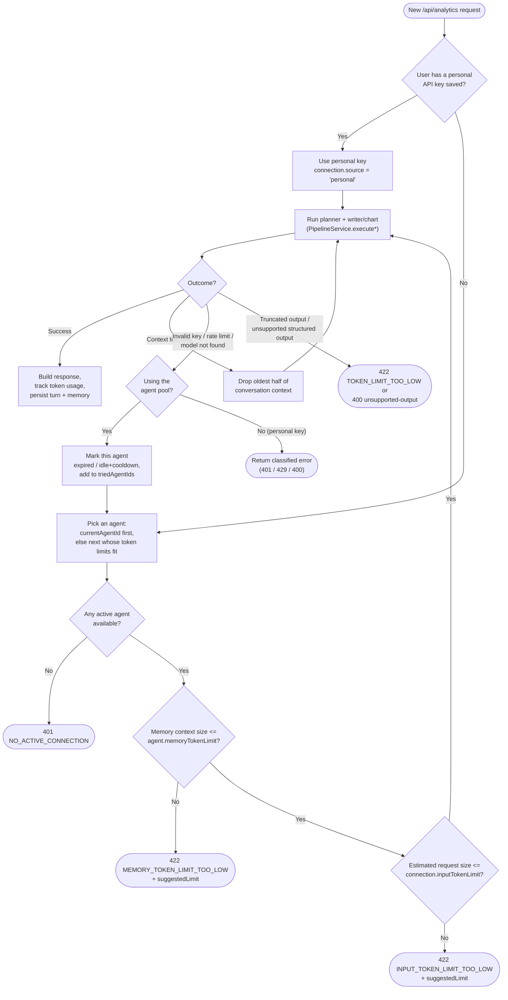

This loop is why a shared agent pool is resilient to any single bad key or rate limit: a failure just removes that agent from consideration for *this* request (`triedAgentIds`) and tries the next one, without the caller ever seeing an error unless every agent is exhausted.

### 4.7 Agent Health State Machine

How one entry in the `agent_config.agents[]` array moves between `active` / `idle` / `expired` / `disabled` — driven by both the every-minute health-check cron ([§16](#16-background-jobs)) and live call outcomes inside the flow above.

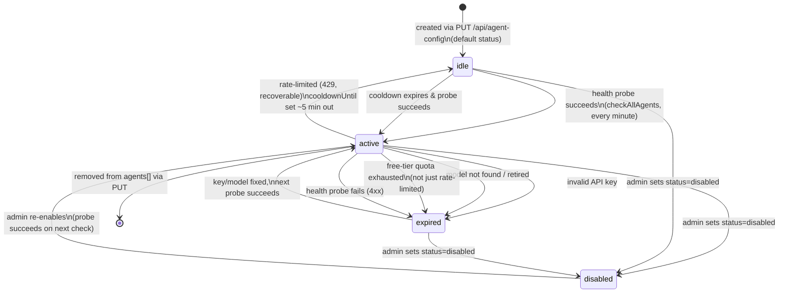

`AgentConfigService.pickCurrentAgentId()` only ever considers an agent "current" if it's `active` and not in an active cooldown — everything else in `AnalyticsService`'s fallback loop ([§4.6](#4-architecture)) walks past `idle`/`expired`/`disabled` agents to find the next usable one.

### 4.8 Planner Validation & Retry Flow

What happens between the planner's raw LLM output and a MongoDB `aggregate()` call actually running — the single retry described in [§6](#6-ai-pipeline-in-detail), drawn as a flowchart.

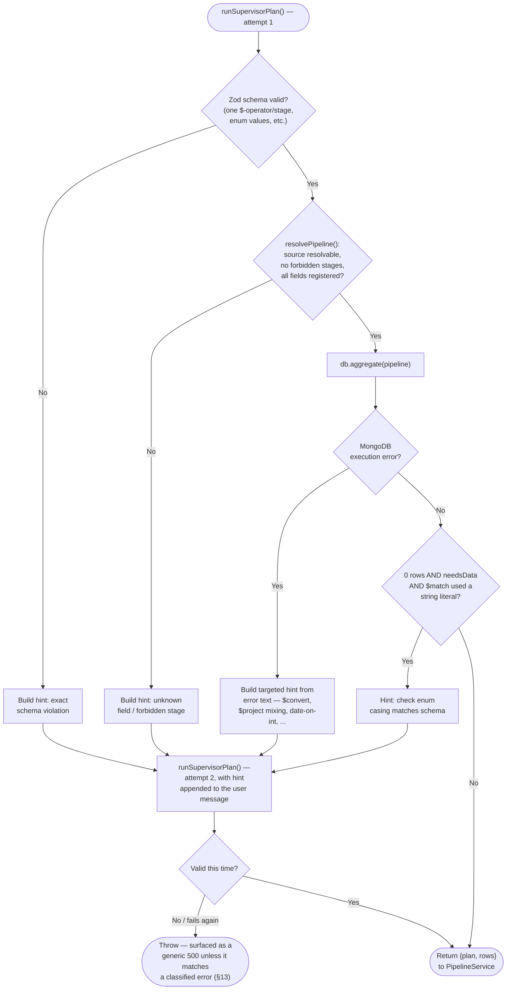

Only **one** retry ever happens — if attempt 2 still fails validation or execution, `PipelineService.aggregate()` throws unconditionally rather than looping further.

### 4.9 Data Source Registration Flow

How a team admin's `POST /api/sources` call becomes something the planner can immediately use, with no server restart:

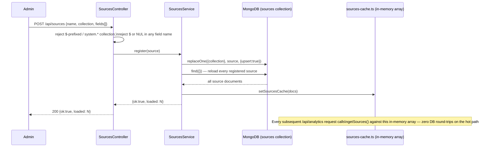

## 5. Backend Modules (nest-app/src)

| Module | Responsibility |
|---|---|
| **`ai/`** | `model.ts` resolves a `LanguageModel` for a given provider/model/API key and wraps calls with rate-limit retry; `planner.ts` builds the MongoDB pipeline (LLM call #1); `chart.ts` turns rows into `DashboardSpec` widgets; `writer.ts` turns rows into report sections or an inquiry summary; `memory-skill.ts` extracts long-term memories from a finished response; `skill-prompt.ts` loads prompt text from `skills/*/SKILL.md`; `token.ts` tracks input/output token usage; `chart-results.repository.ts` logs every generated dashboard for audit/debugging. |
| **`analytics/`** | `AnalyticsController` (`/api/analytics`, `/api/provider`) is the single public entry point. `AnalyticsService` resolves which AI connection to use, manages sessions/memory, classifies and reacts to provider errors (invalid key, rate limit, context-too-long, truncated output, unsupported structured output, model not found), tracks token usage, and shapes the final response. `PipelineService` is the actual query+format engine. |
| **`sources/`** | Data source (dataset) registry: MongoDB-backed CRUD (`SourcesService` / `Source` schema) plus an in-memory cache (`sources-cache.ts`) refreshed on every register/remove so the hot analytics path never hits the DB for schema lookups. |
| **`history/`** | Read/query past aggregation runs (`results_history`) and conversation sessions (delegates session logic to `session/memory.ts`). |
| **`cache/`** | SHA-256 `intent:prompt` → cached `{plan, rows, usage}` (or full dashboard/report), stored in MongoDB with a 7-day TTL index; endpoints to list/clear entries. |
| **`saved-results/`** | Lets a user pin a dashboard/report/inquiry result under a title for later retrieval, scoped by the `x-user-id` header. |
| **`user-settings/`** | Per-user "bring your own API key" configuration: provider, model, token limits, usage counters; validates a key/provider/model combination live against the provider before saving. |
| **`agent-config/`** | A pool of shared fallback AI connections ("agents") used when a user has no personal key configured. Tracks per-agent status (`active`/`disabled`/`expired`/`idle`), cooldowns after rate limits, and usage; `AgentHealthService` periodically re-probes each provider. |
| **`memory/`** | Opt-in long-term memory: extracts durable facts (goal, insight, preference, context, decision, entity, correction) from a conversation turn and retrieves the most relevant ones for future prompts, scoped per user. |
| **`session/memory.ts`** | Short-term, per-session conversation memory backed by a local LibSQL/SQLite file — a functional store (not a Nest module/service) used directly by `AnalyticsService`. |
| **`common/`** | `ApiKeyGuard` (optional global `x-api-key` auth, with `/health`, `/api/meta`, `/api/provider`, `/api/key*` as public exceptions), `RequestIdMiddleware` (per-request UUID via `AsyncLocalStorage`), `AllExceptionsFilter` (normalizes every error response), structured `AppLogger`, `requireUserId()` helper. |

## 6. AI Pipeline in Detail

### Skill files & the prompt-loading mechanism (`ai/skill-prompt.ts`)

Every LLM system prompt in this codebase lives in a `skills/<name>/SKILL.md` markdown file, not inline in TypeScript. `skill-prompt.ts` provides three primitives that make this work:

- **`skillFile(...segments)`** resolves a path under the repo-root `skills/` directory (three `..` hops up from `nest-app/src/ai/` at runtime — i.e. `dist/ai/` after build — back to the repo root).
- **`readMarkdownSection(filePath, heading)`** parses the markdown file, finds a heading line matching `heading` (case-insensitive, any `#` level), and returns everything under it up to the next heading of the same or shallower level. This is how `## System Instructions` and `## Runtime Prompt` inside one `SKILL.md` file become two separate strings in code (e.g. `planner.ts` reads `Runtime Prompt`, `Runtime Prompt Dashboard`, and `Runtime Prompt Non-Dashboard` as three distinct sections of `skills/aggregation/SKILL.md`). Throws at import time (i.e. at server boot) if the heading isn't found — a typo'd heading name is a hard startup failure, not a silent runtime bug.
- **`readJsonSection(filePath, heading)`** does the same lookup, then extracts and `JSON.parse`s the first fenced code block inside that section — this is how `pipeline.service.ts` and `planner.ts` both load the `Pipeline Config` block (`forbiddenStages`, `stageSemantics`) from `skills/aggregation/SKILL.md` as actual TypeScript objects instead of duplicating that list in code.
- **`interpolateTemplate(template, values)`** does a single-pass `{{PLACEHOLDER}}` → value substitution (`ai/planner.ts` and `prompts/index.ts` both use this to fill in schema text, row samples, etc. at request time).

Because these reads happen once at module import (server boot), editing a `SKILL.md` file requires a server restart to take effect — there is no hot-reload.

**Dead skill folders.** Grepping every `skillFile(...)` call site in `nest-app/src` turns up exactly five distinct skill names ever requested: `aggregation`, `chart`, `report`, `inquiry`, `memory`. Three of the eight folders under `skills/` — **`writer/`, `analytics/`, `suggestions/`** — are never referenced by any `skillFile()` call and are not loaded by the running application. They're either leftovers from the legacy `src/` prototype (which had its own, differently-organized skill usage) or drafts for functionality that was never wired in. Don't assume editing one of those three files changes any runtime behavior — verify with `grep -rn "skillFile(" nest-app/src` before relying on a skill file being live.

### Planner (`ai/planner.ts`) — LLM call #1

Builds the *"YOUR DATABASE SCHEMA"* section of the system prompt from every registered `DataSource`: field names, types, roles, enum/sample values, detected foreign-key references (`resolveReference()` — matches an explicit `referenceTo`, a description hint, or a name/collection prefix match), and ready-to-copy `$lookup`/`$group`/count/sum pipeline templates per collection. The model must return a `TaskPlan`:

```jsonc
{
  "needsData": true,
  "query": { "sourceName": "Projects" },
  "pipeline": [ /* MongoDB aggregation stages, one operator per stage */ ],
  "strategy": "standard",     // dashboard only: standard | trend | comparison | anomaly | overview
  "chartHint": "ranking"      // dashboard only — free-form hint consumed by chart.ts
}
```

`buildPlanSchema(intent)` (Zod) enforces: exactly one `$`-prefixed operator key per pipeline stage, `strategy` restricted to `PLANNER_STRATEGIES` (`standard | trend | comparison | anomaly | overview`), and intent-specific shape (dashboard requires `strategy`/`chartHint`; report adds `wantChart`). `finalizeTaskPlan()` then normalizes `sourceName` against the actual registered source list and derives `skills[]` (`deriveExecutionSkills()`) from `needsData` + `intent`.

`PipelineService.runWithRetry()` (in `pipeline.service.ts`) validates the plan further — no forbidden stages (`$function`, `$merge`, `$out`, `$where`, `$eval`, loaded from `skills/aggregation/SKILL.md`'s `Pipeline Config` section), only known field references (`validatePipelineFields()`) — and retries **once** with a targeted correction hint if validation or the MongoDB execution itself fails. The hint text is built specifically for the failure class, for example:

| Failure pattern detected | Hint given back to the LLM |
|---|---|
| Stage has 0 or >1 `$`-operator keys | "Each pipeline item must be exactly one MongoDB stage object like `{ "$match": {...} }`…" |
| `$convert` to date without `onError`/`onNull` | "…always use `$convert` with `onError: null` and `onNull: null`…" |
| Mixed inclusion/exclusion in `$project` | "…add a separate `$unset` stage BEFORE `$project` to remove the joined `_id`…" |
| Date operator (`$year`, `$dateToString`, …) on an integer field | Names the exact field(s) stored as integers and says not to use date operators on them |
| Pipeline returned 0 rows but a `$match` used a string literal | "…enum values use exact casing from schema allowed values" |

If both attempts fail, `aggregate()` throws — the analytics layer surfaces this as a generic 500 unless it matches one of the classified error types in [§13](#13-error-handling--resilience).

### Chart builder (`ai/chart.ts` + `prompts/index.ts`) — LLM call #2 (dashboard, and report when `wantChart`)

Unlike the planner, the chart LLM is **not** filling in a fixed template — per `skills/chart/SKILL.md` it is instructed to author a *complete, arbitrary ECharts `option` object* (bar/line/area/scatter/pie/funnel/radar/heatmap, stacked/dual-axis/multi-series, `dataset`+`encode`, `visualMap`, `markLine`, etc.), or to fall back to `type: "table"` with a `columns[]` list when a raw table is clearly better than a chart.

**What the model is shown** (`buildChartPrompt()` in `prompts/index.ts`), not the raw rows verbatim:
- `profileColumns()` inspects up to `CHART_PROFILE_ROWS` (default 16) sample rows and, per column, reports `distinctCount`, up to 5 `sampleValues`, the JS `typeof`, and — when the column matches a registered source field — the schema's declared `type`/`role`. This is what lets the skill prompt reason about "is this scatter-capable" or "is this a bounded categorical field" without seeing the full dataset.
- A `SAMPLE_ROWS` block with up to `CHART_SAMPLE_ROWS` (default 12) raw rows, and a `DATA_ROWS` block with up to `CHART_DATA_MAX_ROWS` (default 120) rows capped at `CHART_DATA_MAX_CHARS` (default 30,000) characters total — `dataBlock()`/`serializeRows()` stop adding rows the moment the char budget would be exceeded and explicitly mark the block `TRUNCATED` so the model doesn't extrapolate incorrect totals from partial data.
- A configurable `CHART_STYLE_CONTEXT` string (styling defaults: transparent backgrounds, dataset+encode preferred, concise legends/tooltips, no exotic animation) and, if the source has `suggestedCharts`, those are prepended as "domain reference, not a fixed template."

**What happens to the model's output** (`ai/chart.ts`):
- **No live data required from the model.** The model may omit `option.dataset.source` entirely — `attachDatasetSource()` injects the real MongoDB rows into `dataset.source` (or wraps a bare option in `{ dataset: { source: rows }, ...option }`) after generation, so the LLM never has to transcribe row values into its response.
- **Widget count** is capped at `CHART_MAX_WIDGETS` (default 4); each widget needs a `title`, and either a non-empty `option` or `type: "table"`.
- **Size/depth guard.** The returned option is walked by `sanitizeJson()`, which drops anything past `CHART_JSON_MAX_DEPTH` (default 20) or once `CHART_JSON_MAX_PROPERTIES` (default 8,000) values have been counted — a guard against a runaway or adversarial LLM response ballooning the response payload.
- **Renderability check.** `hasRenderableSignal()` drops any widget whose sanitized option has none of the known ECharts top-level keys (`series`, `dataset`, `graphic`, `geo`, etc.) — an empty or decorative-only option never reaches the client.
- **Heatmap safety net.** If a `heatmap` series exists with no `visualMap`, `ensureHeatmapVisualMap()` computes a `min`/`max` continuous `visualMap` from the actual row values so the heatmap isn't rendered uncolored.
- `strategy` and `chartHint` from the plan are advisory, not mandatory — the skill prompt explicitly tells the model to reconcile an infeasible hint (e.g. `scatter` requested but only one numeric field exists) against what the actual data supports, silently choosing the best fit.
- Table rows are capped at `CHART_TABLE_MAX_ROWS` (default 100).

See [§9](#9-examples--prompts-requests--responses) for full, realistic `option` payloads (bar, donut/pie, dual-axis line+bar, and table widgets).

### Writer (`ai/writer.ts`) — LLM call #2 (report/inquiry)

`runInquirySkill` returns a 1–3 sentence `{ summary }` (max `INQUIRY_MAX_TOKENS`, sees at most `INQUIRY_MAX_ROWS` rows). `runReportSkill` returns 1–5 `{ heading, body }` sections (max `REPORT_MAX_TOKENS`), optionally paired with a chart when `withChart` is set (report intent + chart skill + ≥2 rows) — when `withChart` is true, `buildReportMessage()` explicitly tells the writer *not* to restate distributions/rankings in prose since the chart already shows them, and to focus on insights/comparisons/recommendations instead. Row data sent to either is character-capped at `WRITER_MAX_CHARS` by `prompts/index.ts`'s `buildInquiryMessage`/`buildReportMessage` (same truncate-and-mark-truncated logic as the chart prompt).

### Long-term memory extraction (`ai/memory-skill.ts`) — LLM call, best-effort, off the request's critical path

After a response is built, `AnalyticsService.maybeExtractMemory()` fires `extractMemories(prompt, responseSummary, ...)` if the response summary is longer than `MIN_SUMMARY_LENGTH_FOR_MEMORY` (30 characters) — this call happens after the client has already received its response conceptually, but is currently awaited via a fire-and-forget `void` call, not truly backgrounded off the request lifecycle. It asks the model (role `memory`, its own `skills/memory/SKILL.md` prompt) to extract **at most 3** memory items, each: `type` (`goal|insight|preference|context|decision|entity|correction`), `content` (5–300 characters), up to 5 `tags`, and an `importance` 1–5. A failure here is swallowed and logged, never surfaced to the user — memory extraction is explicitly best-effort. See `MemoryRepository.upsert()` in [§7](#7-data-model--mongodb-collections) for the fuzzy-dedupe logic that updates an existing similar memory instead of creating a duplicate.

### Model client (`ai/model.ts`)

One function, `resolveModel()`, maps a `{ apiKey, provider, model }` triple to a Vercel AI SDK `LanguageModel`:

```
anthropic → createAnthropic({ apiKey })(model)
google    → createGoogleGenerativeAI({ apiKey, baseURL })(model)
groq      → createGroq({ apiKey, baseURL })(model)
openai    → createOpenAI({ apiKey, baseURL }).chat(model)
mistral / together / perplexity / <unknown-but-known-baseURL>
          → createOpenAI({ apiKey, baseURL, fetch: openAICompatFetch }).chat(model)
```

Provider can be auto-detected from the API key's prefix (`gsk_` → groq, `sk-ant-` → anthropic, `AIza` → google, `sk-` → openai) if not given explicitly — used mainly as a fallback in `skillProviderOptions()`. `withRateLimitRetry()` retries up to 3 times on a 429, backing off using `Retry-After` / `x-ratelimit-reset-tokens` response headers when present, and gives up immediately if the provider signals a long-term (not just short backoff) limit.

### Access resolution (`analytics/analytics.service.ts`)

Every request first tries the caller's personal API key (`UserSettingsService`, keyed by `x-user-id`); if none is configured it falls back to the shared **agent pool** (`AgentConfigService`), picking the currently active agent, or the next one whose input/memory token limits fit the request. On failure the service classifies the error and either:
- retries with the next agent in the pool (invalid key, rate limit, model not found),
- drops the oldest half of the conversation context and retries in-process (context length exceeded), or
- returns a structured error with a suggested fix, e.g. a computed `suggestedLimit` (truncated output, token limit too low).

The full decision tree for this is diagrammed in [§4.6](#4-architecture); the state machine an agent moves through is diagrammed in [§4.7](#4-architecture). The two subsections below go deeper on the two things every one of those decisions is actually gated on — tokens and agents — end to end.

### Token accounting — the complete lifecycle

"Tokens" show up in four different places in this codebase, and it's easy to confuse them. Here is every one, in the order they happen for a single request:

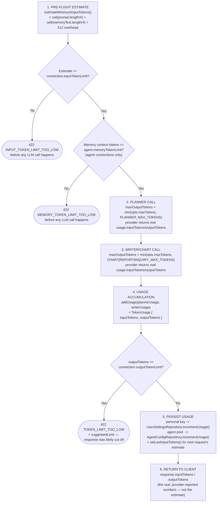

Read left to right, the key distinction is: **steps 1–3 (checks) use an *estimate*** (character-count-based, not a real tokenizer — `Math.ceil(text.length / 4)`), while **steps 4–6 (accounting) use the *real* numbers** the provider returned in its response. This means a request can pass the pre-flight estimate check and still get rejected afterward at step 4 (`TOKEN_LIMIT_TOO_LOW`) if the model's actual output ran long — the estimate is a cheap early filter, not a guarantee.

**Where each number is stored:**

| Number | Lives on | Reset by |
|---|---|---|
| `inputTokenLimit` / `outputTokenLimit` | `user_settings.responseTokenLimit`/`inputTokenLimit` (personal) or `agent_config.agents[].inputTokenLimit`/`outputTokenLimit` (shared) | Only by an explicit `PATCH .../token-limit` call — never automatically |
| `memoryTokenLimit` | `agent_config.agents[].memoryTokenLimit` only — **personal connections have no memory token limit check at all** | Only by an explicit `PATCH /api/agent-config/token-limit` call |
| `inputTokensUsed` / `outputTokensUsed` (cumulative) | `user_settings` (personal) or `agent_config.agents[]` (shared) | The `resetMonthlyUsage()` cron, 1st of the month ([§16](#16-background-jobs)) — **personal (`user_settings`) usage counters are never reset by anything**, only the shared agent pool's are |
| `lastInputTokens` (agent pool only) | `agent_config.agents[].lastInputTokens` | Overwritten every successful request; used as a *floor* for the next request's pre-flight estimate (`Math.max(minimumInputTokens, lastInputTokens)`) so a connection that's been fine for large prompts doesn't get a falsely-low estimate on the next one |

This asymmetry is worth internalizing: **the monthly reset cron only touches the shared agent pool.** A personal `user_settings` connection accumulates `inputTokensUsed`/`outputTokensUsed` forever with no automatic reset — `DELETE /api/settings` (removing the connection) is currently the only way to zero it out.

### Skills — the complete map (active, dead, and how a prompt becomes a skill call)

```mermaid
flowchart LR
    File["skills/&lt;name&gt;/SKILL.md\n(markdown, checked into git)"] -->|"readMarkdownSection(path, heading)\nat module import / server boot"| Section["Extracted section string\n(e.g. 'Runtime Prompt')"]
    Section -->|"interpolateTemplate(str, values)\nat request time"| Filled["Filled prompt\ne.g. PLACEHOLDER tokens swapped for\nreal schema / sample rows / user prompt"]
    Filled -->|"instructions param"| Agent["createSkillAgent(role, instructions, apiKey, model, provider)\n(new Mastra Agent per call)"]
    Agent -->|"agent.generate([...messages], {structuredOutput: zodSchema})"| LLM["External LLM provider"]
    LLM --> Result["result.object\n(validated against the Zod schema)\n+ result.usage"]
```

Five skill names are ever passed to `skillFile()` in the running code — verified by grepping every call site, not by reading folder names:

| Skill folder | Status | Loaded by | Role passed to `createSkillAgent()` |
|---|---|---|---|
| `aggregation/SKILL.md` | ✅ ACTIVE | `ai/planner.ts`, `analytics/pipeline.service.ts` | `supervisor` |
| `chart/SKILL.md` | ✅ ACTIVE | `ai/chart.ts`, `prompts/index.ts` | `chart` |
| `report/SKILL.md` | ✅ ACTIVE | `ai/writer.ts` (`runReportSkill`) | `writer` |
| `inquiry/SKILL.md` | ✅ ACTIVE | `ai/writer.ts` (`runInquirySkill`) | `writer` |
| `memory/SKILL.md` | ✅ ACTIVE | `ai/memory-skill.ts` | `memory` |
| `writer/SKILL.md` | ❌ DEAD | *nothing* — no `skillFile('writer', ...)` call exists | — |
| `analytics/SKILL.md` | ❌ DEAD | *nothing* | — |
| `suggestions/SKILL.md` | ❌ DEAD | *nothing* | — |

Notice `report` and `inquiry` both resolve to the **same** `role: 'writer'` when calling `createSkillAgent()` — "role" here just picks which per-role model/timeout defaults apply conceptually (there's actually only one `AgentRole` union with `supervisor | writer | chart | memory`), it is not a 1:1 mapping with skill-folder names. This is exactly the kind of naming mismatch that made the three dead folders easy to miss in the first place — `skills/writer/` *sounds* like it should be the one loaded for role `writer`, but it isn't; `report/SKILL.md` and `inquiry/SKILL.md` are.

## 7. Data Model — MongoDB Collections

### `sources` — registered datasets (`sources/sources.service.ts`)

```ts
interface DataSource {
  name: string;              // human label; planner refers to it as query.sourceName
  collection: string;        // actual MongoDB collection name (unique, indexed)
  description?: string;
  fields: DataSourceField[]; // { name, label?, description?, type, role?, enumValues?, referenceTo?, sampleValues?, searchable?, tags? }
  joins?: DataSourceJoin[];  // explicit { from, localField, foreignField, as } $lookup hints
  suggestedCharts?: SuggestedChart[];
}
```
`field.type` ∈ `string | number | integer | boolean | date | datetime | enum | reference | array | object | geo | text`. `field.role` ∈ `dimension | measure | temporal | id | text`. Registering rejects `$`-prefixed or `system.*` collection names, and any field name containing `$` or a NUL byte. See [§9](#9-examples--prompts-requests--responses) for a full `POST /api/sources` request body. `sources/sources-cache.ts` is intentionally trivial — a module-level array (`getSources()`/`setSourcesCache()`) plus `normalizeToken()` (lowercases, strips whitespace/`-`/`_`) used everywhere a user- or LLM-supplied source name needs to be matched tolerantly against the registry.

### `prompt_cache` — cached pipeline/dashboard/report results (`cache/cache.service.ts`)

```ts
{
  key: string;        // sha256(`${intent}:${normalizedPrompt}`).slice(0, 24), unique+indexed
  prompt: string;
  intent: string;      // 'dashboard' | 'report' | 'general_question' | 'dashboard:full' | 'report:full'
  result: unknown;     // AggregationResult, or a full DashboardSpec/ReportResult for the ":full" variants
  hitCount: number;
  lastHitAt: Date;
  createdAt: Date;     // TTL-indexed, expires after 7 days
}
```
Bypassed entirely whenever the request carries session context (a follow-up turn) — a cached answer to an isolated prompt cannot correctly answer a context-dependent follow-up.

### `results_history` — every executed pipeline (`history/results-history.repository.ts`)

```ts
{ prompt, intent, collection, pipeline: unknown[], rows: Record<string, unknown>[], rowCount, durationMs, createdAt }
```
Written fire-and-forget from `PipelineService.flush()` whenever a pipeline returns rows. `list()` supports `{ intent?, skip, limit≤100 }`; `findById`/`deleteById` validate the id is a 24-hex ObjectId first.

### `saved_results` — user-pinned outputs (`saved-results/saved-results.repository.ts`)

```ts
{ userId, title (≤200), prompt (≤1000), intent: 'dashboard'|'report'|'inquiry', result: unknown, createdAt, updatedAt }
```
Indexed on `{ userId: 1, createdAt: -1 }`. All reads/writes are scoped to the `x-user-id` header (see [§15](#15-security-model--trust-boundaries) for why that's not real per-user isolation).

### `user_settings` — per-user BYO API key (`user-settings/user-settings.repository.ts`)

```ts
{ userId (unique), apiKey, provider, model, responseTokenLimit=4000, inputTokenLimit, inputTokensUsed=0, outputTokensUsed=0 }
```

### `agent_config` — shared fallback AI connection pool (`agent-config/agent-config.repository.ts`)

A **single document** holding:
```ts
{
  memoryLimit: number;             // default 50 — max long-term memory items injected per request
  currentAgentId: string | null;   // the agent tried first
  agents: AgentEntry[];            // see below
}
interface AgentEntry {
  id: string; status: 'active'|'disabled'|'expired'|'idle';
  provider: string; model: string; apiKey: string;
  inputTokenLimit=8000; outputTokenLimit=8000; memoryTokenLimit=4000;
  inputTokensUsed=0; outputTokensUsed=0; lastInputTokens=0;
  cooldownUntil?: Date|null; lastFailureReason?: string;
}
```
Status transitions are driven by `AgentHealthService` (probe results) and by `AnalyticsService` reacting to live call failures (`updateRuntime()`), see [§16](#16-background-jobs).

### `memory_items` / `memory_settings` — long-term memory (`memory/memory.repository.ts`)

```ts
{ userId, sessionId, type: 'goal'|'insight'|'preference'|'context'|'decision'|'entity'|'correction', content, tags: string[], importance: 1-5, createdAt }
```
`findRelevant()` is a lightweight keyword/tag overlap scorer (`hits/words + importance/20`) over the user's most recent 100 items — not a vector/embedding search despite the field name suggesting otherwise. `upsert()` de-duplicates by taking the first 60 characters of new content, escaping it into a case-insensitive regex, and looking for an existing memory of the same `userId`+`type` whose content matches — if found it's updated in place (content/tags/importance/sessionId) rather than duplicated. `memory_settings` holds a single global `extractionEnabled` boolean toggled via `PATCH /api/memory/config`.

### `chart_results` — dashboard audit log (`ai/chart-results.repository.ts`)

```ts
{ prompt, sourceName, dashboard: DashboardSpec, createdAt }
```
Saved fire-and-forget whenever a chart with ≥1 widget is produced; write failures are logged and swallowed (never affects the response).

### LibSQL (`./data/memory.db`) — short-term conversation memory (`session/memory.ts`)

Not MongoDB — a local SQLite file managed by `@mastra/memory`/`@mastra/libsql`. One thread per `sessionId`, with `title`, `metadata.intent`, and up to the last N messages retrievable as `CoreMessage[]` via `getMemoryContext()`. Each assistant message embeds the full `MessageResult` (`dashboardSpec` / `reportSections` / `summary` + `durationMs`) in `metadata.uiMessage` so the history endpoints can reconstruct rich turns.

## 8. API Reference

All routes are prefixed `/api` unless noted. When `API_KEY` is set, every route requires an `x-api-key` header **except** `/health`, `/api/meta`, `/api/provider`, and anything under `/api/key*`.

### `POST /api/analytics` — the main entry point

Request:
```jsonc
{ "prompt": "top 5 projects by budget", "intent": "dashboard", "sessionId": "optional-uuid" }
```
Headers: `x-user-id: <any non-empty string>` (required — see [§15](#15-security-model--trust-boundaries)).

Response (dashboard example — abbreviated; see [§9](#9-examples--prompts-requests--responses) for the complete, unabbreviated payload):
```jsonc
{
  "intent": "dashboard",
  "chart": {
    "layout": "analytical",
    "title": "top 5 projects by budget",
    "summary": "Downtown Transit Hub leads with $12.4M, more than double the next project.",
    "widgets": [ { "id": "w1", "type": "bar chart", "title": "...", "option": { /* full ECharts option */ } } ]
  },
  "sessionId": "…", "messageId": "…",
  "inputTokens": 812, "outputTokens": 240,
  "connection": { "source": "agent", "provider": "groq", "model": "llama-3.3-70b-versatile", "agentId": "…" }
}
```
Report/inquiry responses replace `chart` with `reportSections: [{heading, body}]` or `summary: string` respectively. See [§19](#19-error-response-format) for the error shape and possible `code`s.

### Full route table

| Method | Path | Auth | Purpose |
|---|---|---|---|
| `GET` | `/health` | — | Mongo ping + registered source count (`503` if Mongo is down or 0 sources) |
| `GET` | `/api/docs` | — (public route) | Live Swagger UI — browse and try every endpoint interactively |
| `GET` | `/api/docs-json` | — (public route) | Raw OpenAPI 3 spec, e.g. for generating a typed client |
| `POST` | `/api/analytics` | ✓ + `x-user-id` | Main AI query — see above |
| `GET` | `/api/provider` | — | Static placeholder (`{ provider: '', hasGlobalKey: false }`) |
| `GET` | `/api/sources` | ✓ | List registered datasets |
| `POST` | `/api/sources` | ✓ | Register/update a dataset — `{ name, collection, description?, fields[] }` |
| `DELETE` | `/api/sources/:collection` | ✓ | Remove a dataset |
| `GET` | `/api/meta` | — | Available modes + example prompts derived from registered sources |
| `GET` | `/api/history/results?intent=&skip=&limit=` | ✓ | Past pipeline runs (`limit` capped at 100) |
| `GET` | `/api/history/results/:id` | ✓ | Full pipeline run detail |
| `GET` | `/api/history/sessions` | ✓ | List conversation sessions |
| `GET` | `/api/history/sessions/:sessionId` | ✓ | Session detail with all messages |
| `DELETE` | `/api/history/sessions/:sessionId` | ✓ | Delete a session |
| `GET` | `/api/cache` | ✓ | List prompt-cache entries (result payload excluded) |
| `DELETE` | `/api/cache/:key` | ✓ | Delete one cache entry |
| `DELETE` | `/api/cache` | ✓ | Clear all cache entries |
| `GET` | `/api/saved` | ✓ + `x-user-id` | List a user's saved results |
| `POST` | `/api/saved` | ✓ + `x-user-id` | Save a result — `{ title, prompt?, intent, result }` → `201` |
| `GET` | `/api/saved/:id` | ✓ + `x-user-id` | Fetch one saved result |
| `DELETE` | `/api/saved/:id` | ✓ + `x-user-id` | Delete a saved result |
| `POST` | `/api/settings/models` | ✓ | List models for a provider — `{ provider }` |
| `POST` | `/api/settings/validate` | ✓ | Validate an API key/provider/model combo live |
| `GET` | `/api/settings` | ✓ + `x-user-id` | Get current settings (masked key preview + usage) |
| `POST` | `/api/settings` | ✓ + `x-user-id` | Save personal API key/provider/model/limits |
| `PATCH` | `/api/settings/token-limit` | ✓ + `x-user-id` | Update response/input token limit |
| `DELETE` | `/api/settings` | ✓ + `x-user-id` | Remove personal settings (falls back to shared agents) |
| `GET` | `/api/memory` | ✓ + `x-user-id` | List long-term memory items |
| `DELETE` | `/api/memory` | ✓ + `x-user-id` | Clear a user's long-term memory |
| `GET` | `/api/memory/config` | ✓ | Get global memory-extraction toggle |
| `PATCH` | `/api/memory/config` | ✓ | Enable/disable memory extraction globally |
| `GET` | `/api/agent-config` | ✓ | Get the shared agent pool config |
| `PUT` | `/api/agent-config` | ✓ | Replace the agent pool (triggers an immediate health check) |
| `PATCH` | `/api/agent-config/token-limit` | ✓ | Update one agent's input/output/memory token limit |

### Request body validation reference

Exact `class-validator` constraints per DTO, so integrations don't have to guess at limits:

| Endpoint | Field | Constraint |
|---|---|---|
| `POST /api/analytics` | `prompt` | string, 1–1000 chars (enforced again server-side via a Zod schema in `analytics.service.ts`, not just the DTO) |
| | `intent` | optional string (no enum validation at the DTO level — an unrecognized value falls through to the generic `execute()` path) |
| | `sessionId` | optional string or `null` |
| `POST /api/saved` | `title` | string, ≤200 chars |
| | `prompt` | optional string, ≤1000 chars |
| | `intent` | string (mapped to `dashboard`/`report`/`inquiry`; `general_question` is accepted as an alias for `inquiry`) |
| | `result` | required, any type |
| `POST/PATCH /api/settings` | `apiKey` | string, 1–500 chars |
| | `provider` | string, 1–100 chars |
| | `model` | string, 1–200 chars |
| | `responseTokenLimit` / `inputTokenLimit` | optional integer, 1–128,000 |
| `PATCH /api/settings/token-limit` | `responseTokenLimit` / `inputTokenLimit` | integer, 1–128,000 (validated manually in the controller, not via DTO decorators) |
| `PATCH /api/memory/config` | `extractionEnabled` | boolean |
| `PUT /api/agent-config` | `memoryLimit` | optional integer, ≥1 |
| | `currentAgentId` | optional string (1–100 chars) or `null` |
| | `agents[].id` | optional string, 1–100 chars (auto-generated via `randomUUID()` if omitted or duplicated) |
| | `agents[].status` | one of `active`/`disabled`/`expired`/`idle` |
| | `agents[].provider` | string, 1–100 chars |
| | `agents[].model` | string, 1–200 chars |
| | `agents[].apiKey` | string, 1–500 chars |
| | `agents[].inputTokenLimit` / `outputTokenLimit` | optional integer, ≥1 |
| | `agents[].memoryTokenLimit` | optional integer, 1–128,000 |
| | `agents[].inputTokensUsed` / `outputTokensUsed` | optional integer, ≥0 |
| `PATCH /api/agent-config/token-limit` | `agentId` | string, 1–100 chars |
| | `field` | one of `input`/`output`/`memory` |
| | `value` | integer, 1–128,000 |
| `POST /api/sources` | `name`, `collection`, `fields[]` | required (validated manually in `SourcesController`, not via class-validator); `collection` rejects `$`-prefixed/`system.*` names; each `fields[].name` rejects a leading `$` or an embedded NUL byte |

The global `ValidationPipe({ whitelist: true, transform: true })` in `main.ts` strips any body property not declared on a DTO and coerces primitives to their declared types before the constraints above are checked.

## 9. Examples — Prompts, Requests & Responses

All examples below use a `Projects` source registered like this:

```jsonc
// POST /api/sources
{
  "name": "Projects",
  "collection": "projects",
  "description": "Municipal infrastructure projects",
  "fields": [
    { "name": "title",    "type": "string",  "role": "dimension" },
    { "name": "status",   "type": "enum",    "role": "dimension", "enumValues": ["planned", "active", "completed"] },
    { "name": "region",   "type": "string",  "role": "dimension" },
    { "name": "budget",   "type": "number",  "role": "measure" },
    { "name": "year",     "type": "integer", "role": "temporal" }
  ]
}
```

Every `/api/analytics` call below also sends:
```
Content-Type: application/json
x-user-id: user-123
```

### 9.1 Dashboard — single ranking chart

**Prompt:** *"top 5 projects by budget"*

Request:
```jsonc
POST /api/analytics
{ "prompt": "top 5 projects by budget", "intent": "dashboard" }
```

Response:
```jsonc
{
  "intent": "dashboard",
  "chart": {
    "layout": "analytical",
    "title": "Top 5 Projects by Budget",
    "summary": "Downtown Transit Hub leads at $12.4M — more than double the next project.",
    "widgets": [
      {
        "id": "w1",
        "type": "bar chart",
        "title": "Top 5 Projects by Budget",
        "insight": "Downtown Transit Hub accounts for over a third of the combined top-5 budget.",
        "option": {
          "tooltip": { "trigger": "axis" },
          "grid": { "left": 16, "right": 16, "top": 24, "bottom": 24, "containLabel": true },
          "xAxis": { "type": "category" },
          "yAxis": { "type": "value", "name": "Budget (USD)" },
          "series": [
            { "type": "bar", "name": "Budget", "encode": { "x": "title", "y": "budget" } }
          ],
          "dataset": {
            "source": [
              { "title": "Downtown Transit Hub",       "budget": 12400000 },
              { "title": "Riverside Water Treatment",   "budget": 5800000 },
              { "title": "North Bridge Rehabilitation", "budget": 4200000 },
              { "title": "Solar Grid Expansion",        "budget": 3100000 },
              { "title": "Central Library Renovation",  "budget": 2600000 }
            ]
          }
        }
      }
    ]
  },
  "sessionId": "5b6e2a8e-2b41-4c9a-9f2d-3a7e0c1d9b44",
  "messageId": "9d3f4b21-7a6e-4e0a-8c3d-1f5a2b6e9c70",
  "inputTokens": 812,
  "outputTokens": 236,
  "connection": {
    "source": "agent",
    "provider": "groq",
    "model": "llama-3.3-70b-versatile",
    "agentId": "a1f3c9d0-...",
    "outputTokenLimit": 8000,
    "inputTokenLimit": 8000
  }
}
```

> Note the `dataset.source` array: the LLM only had to decide `series.type: "bar"` and `encode: { x: "title", y: "budget" }` — the runtime (`attachDatasetSource()` in `ai/chart.ts`) filled in the real rows returned by MongoDB. This is true for every chart widget in this codebase; the model never transcribes data values by hand.

### 9.2 Dashboard — composition (donut/pie)

**Prompt:** *"breakdown of projects by status"*

Request:
```jsonc
POST /api/analytics
{ "prompt": "breakdown of projects by status", "intent": "dashboard" }
```

Response widget (rest of the envelope is the same shape as 9.1):
```jsonc
{
  "id": "w1",
  "type": "donut chart",
  "title": "Project Status Composition",
  "insight": "58% of projects are still active; only 12% have been completed.",
  "option": {
    "tooltip": { "trigger": "item" },
    "legend": { "bottom": 0 },
    "series": [
      {
        "type": "pie",
        "radius": ["42%", "72%"],
        "encode": { "itemName": "status", "value": "count" }
      }
    ],
    "dataset": {
      "source": [
        { "status": "active",    "count": 58 },
        { "status": "planned",   "count": 30 },
        { "status": "completed", "count": 12 }
      ]
    }
  }
}
```

### 9.3 Dashboard — trend / dual-axis comparison

**Prompt:** *"show budget and project count by region"*

Response widget:
```jsonc
{
  "id": "w1",
  "type": "dual-axis bar+line",
  "title": "Budget vs. Project Count by Region",
  "insight": "The Central region has the most projects but not the highest total budget — North does, concentrated in fewer, larger projects.",
  "option": {
    "tooltip": { "trigger": "axis" },
    "legend": { "top": 0 },
    "xAxis": [{ "type": "category" }],
    "yAxis": [
      { "type": "value", "name": "Budget (USD)" },
      { "type": "value", "name": "Project Count" }
    ],
    "series": [
      { "type": "bar",  "name": "Budget",        "encode": { "x": "region", "y": "budget" } },
      { "type": "line", "name": "Project Count", "yAxisIndex": 1, "encode": { "x": "region", "y": "projectCount" } }
    ],
    "dataset": {
      "source": [
        { "region": "North",   "budget": 18200000, "projectCount": 9 },
        { "region": "Central", "budget": 15600000, "projectCount": 14 },
        { "region": "South",   "budget": 9800000,  "projectCount": 7 }
      ]
    }
  }
}
```

### 9.4 Dashboard — overview (multiple widgets, `strategy: "overview"`)

**Prompt:** *"give me an overview of the projects data"*

Response `chart.widgets` (2–4 complementary widgets per the chart skill's overview guidance — table included when a raw list is clearly useful alongside the charts):
```jsonc
[
  { "id": "w1", "type": "donut chart", "title": "Projects by Status", "option": { "...": "as in 9.2" } },
  { "id": "w2", "type": "bar chart",   "title": "Budget by Region",   "option": { "...": "as in 9.1, dimension=region" } },
  {
    "id": "w3",
    "type": "table",
    "title": "All Active Projects",
    "insight": "27 active projects across 3 regions.",
    "columns": ["title", "region", "budget", "year"],
    "rows": [
      { "title": "Downtown Transit Hub",     "region": "North",   "budget": 12400000, "year": 2025 },
      { "title": "Riverside Water Treatment","region": "Central", "budget": 5800000,  "year": 2024 }
    ]
  }
]
```
(`rows` on a table widget is capped at `CHART_TABLE_MAX_ROWS`, default 100 — see [§12](#12-configuration-reference).)

### 9.5 Report — with an attached chart

**Prompt:** *"analyze infrastructure projects by region"*

Request:
```jsonc
POST /api/analytics
{ "prompt": "analyze infrastructure projects by region", "intent": "report" }
```

Response:
```jsonc
{
  "intent": "report",
  "reportSections": [
    {
      "heading": "Overview",
      "body": "The portfolio spans 30 projects across three regions with a combined budget of $43.6M. North region holds the largest share of committed funds despite having fewer projects than Central."
    },
    {
      "heading": "Key Findings",
      "body": "Downtown Transit Hub ($12.4M) is the single largest project in the portfolio, representing 28% of total spend. Central region has the highest project count (14) but a lower average budget per project ($1.1M vs. North's $2.0M)."
    },
    {
      "heading": "Regional Breakdown",
      "body": "North: 9 projects, $18.2M. Central: 14 projects, $15.6M. South: 7 projects, $9.8M."
    },
    {
      "heading": "Recommendations",
      "body": "Review South region's lower project velocity relative to its budget allocation; consider reallocating Central's smaller, high-volume projects toward fewer higher-impact initiatives."
    }
  ],
  "chart": {
    "layout": "analytical",
    "title": "analyze infrastructure projects by region",
    "summary": "North leads in budget despite fewer projects than Central.",
    "widgets": [ { "id": "w1", "type": "bar chart", "title": "Budget by Region", "option": { "...": "as in 9.1" } } ]
  },
  "sessionId": "…", "messageId": "…",
  "inputTokens": 1204, "outputTokens": 512,
  "connection": { "source": "personal", "provider": "openai", "model": "gpt-4o-mini" }
}
```
`chart` is only present when the report intent's plan set `wantChart: true` **and** at least 2 rows were returned — otherwise the response has no `chart` key at all.

### 9.6 Inquiry — short factual answer

**Prompt:** *"how many projects are active?"*

Request:
```jsonc
POST /api/analytics
{ "prompt": "how many projects are active?", "intent": "inquiry" }
```

Response:
```jsonc
{
  "intent": "inquiry",
  "summary": "There are 58 active projects across 3 regions, with North holding the largest share at 24.",
  "sessionId": "…", "messageId": "…",
  "inputTokens": 340, "outputTokens": 42,
  "connection": { "source": "agent", "provider": "groq", "model": "llama-3.3-70b-versatile", "agentId": "…" }
}
```

### 9.7 Follow-up in the same session

**Prompt 1:** *"show projects by status"* → note the returned `sessionId`.
**Prompt 2 (same session):** *"now filter to just the North region"*

```jsonc
POST /api/analytics
{ "prompt": "now filter to just the North region", "intent": "dashboard", "sessionId": "5b6e2a8e-2b41-4c9a-9f2d-3a7e0c1d9b44" }
```
The prompt cache is bypassed for this call (session context is non-empty), and the planner receives the prior turn as conversation context so it can add a `$match: { region: "North" }` stage without the user having to repeat the original ask.

### 9.8 No matching data

**Prompt:** *"show projects in Antarctica"* (no such region in the data)

```jsonc
{
  "intent": "dashboard",
  "chart": {
    "layout": "operational",
    "title": "show projects in Antarctica",
    "summary": "No matching records were found for this dashboard request. Try broadening the filters or rephrasing the question.",
    "widgets": []
  },
  "sessionId": "…", "messageId": "…",
  "inputTokens": 640, "outputTokens": 0
}
```

### 9.9 Error example — no active AI connection

```jsonc
// 401 Unauthorized
{
  "error": "No active AI connection. Your agent may be expired, disabled, or quota-exhausted. Open Config to re-enable it or add a new connection.",
  "code": "NO_ACTIVE_CONNECTION"
}
```

See [§19](#19-error-response-format) for the full list of error `code`s and [§22](#22-troubleshooting) for how to resolve each one.

## 10. Frontend (client/)

An Angular 21 single-page app (`client/src/app/`, standalone components, no routing module — one view):

- **`app.component.ts`** — top-level shell: prompt input, intent selector, session handling.
- **`analytics-api.service.ts`** — thin HTTP client for the `/api/*` endpoints above.
- **`analytics-state.service.ts`** — client-side state (current session, last result, loading/error state).
- **`widget-grid.component.ts`** — renders a `DashboardSpec`'s widgets in a responsive grid.
- **`chart-render.service.ts`** — turns a widget's `option` into an ECharts instance.
- **`markdown.pipe.ts`** — renders report section bodies as Markdown.
- **`app.types.ts`** — the frontend's mirror of the backend's `DashboardSpec`/`ReportResult`/`InquiryResult` shapes.

Run it with `npm start` from `client/` (proxies API calls to the NestJS server per [`client/proxy.conf.json`](client/proxy.conf.json)). Production build: `npm run build` → `client/dist/mind-ui/browser`, which the backend can serve directly (see [§18](#18-deployment)).

## 11. Getting Started

Prerequisites: Node.js 20+, a running MongoDB instance, and an API key for at least one supported LLM provider (or plan to configure a shared agent after boot).

```powershell
# 1. Backend
cd nest-app
copy .env.example .env    # if present — otherwise create .env, see §12
npm install
npm run start:dev         # http://localhost:3000

# 2. Frontend (separate terminal)
cd client
npm install
npm start                 # proxies to the backend above
```

First-run checklist:
1. Confirm MongoDB is reachable — `GET /health` should report `mongo: "connected"`.
2. Register at least one dataset: `POST /api/sources` with `{ name, collection, fields: [...] }` (it must already exist in MongoDB with data, or point at an empty collection you plan to seed) — see [§9.1](#9-examples--prompts-requests--responses) for a full example body.
3. Configure an AI connection — either `POST /api/settings` with a personal key (per `x-user-id`), or `PUT /api/agent-config` for a connection shared by everyone with no personal key.
4. Send a prompt: `POST /api/analytics { "prompt": "...", "intent": "inquiry" }` with headers `x-user-id: dev` — see [§9](#9-examples--prompts-requests--responses) for more prompt/response examples.
5. Or skip steps 2–4 above and just open `http://localhost:3000/api/docs` — every route in [§8](#8-api-reference) is there, live, with a "Try it out" button and an "Authorize" lock icon for `x-api-key`/`x-user-id`.

## 12. Configuration Reference

Read from [`nest-app/src/config/configuration.ts`](nest-app/src/config/configuration.ts) and env vars read directly across `nest-app/src`:

```env
# MongoDB (required)
MONGODB_URI=mongodb://127.0.0.1:27017/mindai     # or DB_URL as an alias
MONGODB_DB=mindai
MONGODB_SERVER_SELECTION_TIMEOUT_MS=8000
MONGODB_CONNECT_RETRIES=1
MONGODB_PIPELINE_TIMEOUT_MS=30000                 # maxTimeMS per aggregation

# Server
PORT=3000
SHUTDOWN_TIMEOUT_MS=10000
ALLOWED_ORIGINS=                                  # comma-separated; empty = allow all (dev default)
API_KEY=                                          # enables the x-api-key guard when set

# Conversation memory
LIBSQL_URL=file:./data/memory.db
MEMORY_EXTRACTION_ENABLED=true                    # long-term memory toggle default at boot
MEMORY_MAX_TOKENS=400                             # max output tokens for the memory-extraction LLM call

# Planner / writer token budgets (all optional, shown with defaults)
PLANNER_MAX_TOKENS=600
CHART_MAX_TOKENS=2000
INQUIRY_MAX_TOKENS=400
REPORT_MAX_TOKENS=1500
INQUIRY_MAX_ROWS=10
WRITER_MAX_CHARS=8000

# Chart authoring & data-shown-to-the-LLM tuning (all optional, shown with defaults)
CHART_MAX_WIDGETS=4
CHART_JSON_MAX_PROPERTIES=8000
CHART_JSON_MAX_DEPTH=20
CHART_TABLE_MAX_ROWS=100
CHART_PROFILE_ROWS=16          # rows sampled to build the per-column profile (distinctCount, jsType, ...)
CHART_SAMPLE_ROWS=12           # raw sample rows shown to the chart LLM
CHART_DATA_MAX_ROWS=120        # hard cap on rows included in the full DATA ROWS block
CHART_DATA_MAX_CHARS=30000     # hard cap on characters in the full DATA ROWS block
CHART_STYLE_CONTEXT=           # override the default styling-guidance sentence sent to the chart LLM

# Debugging
TRACE=                        # set to "1" to enable ai/*.ts logTrace() verbose payload logging
DEBUG=                        # set (any truthy value) to enable AppLogger.debug() output

# API documentation
DISABLE_SWAGGER=              # set to "true" to skip mounting /api/docs and /api/docs-json
```

LLM provider credentials are **not** set as server env vars in normal operation — they come from per-user Settings (`/api/settings`) or the shared Agent Config pool (`/api/agent-config`), both stored in MongoDB. This is different from the legacy `src/` prototype, which read a single `GROQ_API_KEY` from the environment — do not port that pattern back in.

## 13. Error Handling & Resilience

`AnalyticsService.run()` classifies provider/LLM failures and reacts specifically instead of surfacing a raw stack trace:

| Condition | Behavior |
|---|---|
| Invalid API key | Marks the agent `expired` and tries the next one (if using the shared pool), otherwise `401` with `code: INVALID_API_KEY` |
| Rate limit (429) | Reads `Retry-After`/rate-limit headers, cools the agent down and tries the next one, otherwise `429` with `code: LLM_RATE_LIMIT` and a human-readable retry time |
| Free-tier quota exhausted | Marks the agent `expired` rather than just cooling down (it won't recover on its own) |
| Model not found / retired | Marks the agent `expired` and tries the next one, otherwise `400` asking the user to pick a valid model |
| Context length exceeded | Drops the oldest half of the conversation context and retries in-process (no error surfaced unless it still fails at empty context) |
| Output truncated (cut off before valid JSON) | `422` with `code: TOKEN_LIMIT_TOO_LOW` and a computed `suggestedLimit` |
| Structured output unsupported by model | `400` asking for a model that supports structured/JSON output |
| Memory context exceeds the connection's memory token limit | `422` with `code: MEMORY_TOKEN_LIMIT_TOO_LOW` before any LLM call is even made |
| Estimated request size exceeds the connection's input limit | `422` with `code: INPUT_TOKEN_LIMIT_TOO_LOW` before any LLM call is even made |
| No usable connection at all | `401` with `code: NO_ACTIVE_CONNECTION` |

Aggregation pipeline generation itself gets **one automatic retry** with a targeted hint describing exactly what validation or MongoDB rule was violated (unknown field, bad `$convert` usage, mixed `$project` exclusion/inclusion, wrong stage shape) — see the table in [§6](#6-ai-pipeline-in-detail).

## 14. Testing

```powershell
cd nest-app
npm run test        # Jest unit tests (*.spec.ts, colocated with source)
npm run test:watch
npm run test:cov    # with coverage
npm run test:e2e    # end-to-end, test/jest-e2e.json + test/test-app.module.ts
```

Existing spec coverage: `common/helpers/user-id`, `analytics/pipeline.service`, `analytics/analytics.service`, `sources/sources.service`, `user-settings/user-settings.service`, `agent-config/agent-config.service`, `ai/model`, `ai/planner`, `ai/writer`. When adding a new service, colocate a `*.spec.ts` next to it — that's the existing convention, not a separate `__tests__` tree. Notably **not yet covered** by a spec file: `ai/chart.ts`, `memory/memory.service.ts`, `cache/cache.service.ts`, `history/history.service.ts`, `saved-results/*`, `agent-config/agent-health.service.ts` — see [§23](#23-known-limitations--roadmap-considerations).

## 15. Security Model & Trust Boundaries

Read this before building anything that assumes real authentication — the current model is deliberately lightweight and has gaps the team should be aware of.

- **`x-api-key` is a single shared secret, not per-user auth.** `ApiKeyGuard` ([`common/guards/api-key.guard.ts`](nest-app/src/common/guards/api-key.guard.ts)) only activates if the `API_KEY` env var is set; when unset, **every route is open**. It gates access to the whole API, not to any particular user's data.
- **`x-user-id` is client-supplied and unverified.** `requireUserId()` ([`common/helpers/user-id.ts`](nest-app/src/common/helpers/user-id.ts)) only checks that the header is non-empty — there is no session, token, or lookup that proves the caller actually owns that ID. Any caller who knows or guesses another user's ID can read/modify their saved results, settings, and memory. Treat `x-user-id` as a **tenant/namespace key, not an authentication credential** — if you need real auth (login, JWT, OAuth), it has to be added in front of this layer (e.g. an API gateway, or a new Nest guard that derives the trusted ID from a verified session instead of trusting the header).
- **API keys are stored in MongoDB in plaintext** (`user_settings`, `agent_config` collections) — there is no encryption-at-rest for provider keys in this codebase. Anyone with DB access can read every configured key. Lock down MongoDB network access and backups accordingly.
- **CORS defaults to allow-all** (`origin: true`) when `ALLOWED_ORIGINS` is unset — fine for local dev, but set `ALLOWED_ORIGINS` explicitly before exposing a deployment publicly.
- **`helmet()` is applied with CSP disabled** (`contentSecurityPolicy: false` in [`main.ts`](nest-app/src/main.ts)) since the app serves its own Angular bundle; re-enable/tune CSP if that changes.
- Registering a data source (`POST /api/sources`) blocks Mongo system collections and `$`-prefixed names, but does **not** otherwise sandbox which collections can be exposed — only register collections that are meant to be queryable through prompts.
- **`/api/docs` and `/api/docs-json` are intentionally public** (`PUBLIC_PREFIXES` in `ApiKeyGuard`) even when `API_KEY` is set — otherwise nobody could load the Swagger UI page to authenticate through it in the first place. This means the full route/DTO shape of the API (field names, types, validation rules) is visible to anyone who can reach the server, even without a valid `x-api-key`. Set `DISABLE_SWAGGER=true` if that shape itself is considered sensitive for a given deployment.
- **No request rate limiting.** Unlike the legacy `src/` prototype (which used `express-rate-limit`), `nest-app` has no rate-limiting middleware at all — the only throttling in the system is reactive, per-provider (`withRateLimitRetry()` backing off *after* a 429). Anything that needs to survive abusive traffic patterns needs a rate limiter added in front of (or inside) `nest-app`.

## 16. Background Jobs

`AgentHealthService` ([`agent-config/agent-health.service.ts`](nest-app/src/agent-config/agent-health.service.ts)) runs two `@nestjs/schedule` cron jobs:

| Schedule | Job | What it does |
|---|---|---|
| Every minute | `checkAllAgents()` | Probes every non-disabled, non-cooldown agent's provider (a lightweight "list models" call via `buildProviderValidationRequest()`) and flips its status between `active`/`expired` based on the response (429 with a quota-exhausted body counts as unhealthy; any other 4xx counts as unhealthy; a listed-but-missing model marks it `expired` too); re-syncs which agent is "current" if the active one changed. |
| `0 0 1 * *` (1st of month, midnight) | `resetMonthlyUsage()` | Resets all agents' tracked input/output token usage counters back to zero. |

Both jobs append a line to `nest-app/logs/agent-health.log` (created on demand) in addition to the NestJS logger, so you can audit agent status flips without digging through general server logs. `AgentHealthService.checkAllAgents()` is also invoked synchronously right after `PUT /api/agent-config` saves a new pool, so status is fresh immediately after an edit rather than waiting up to a minute.

### What `checkAllAgents()` actually does, every 60 seconds

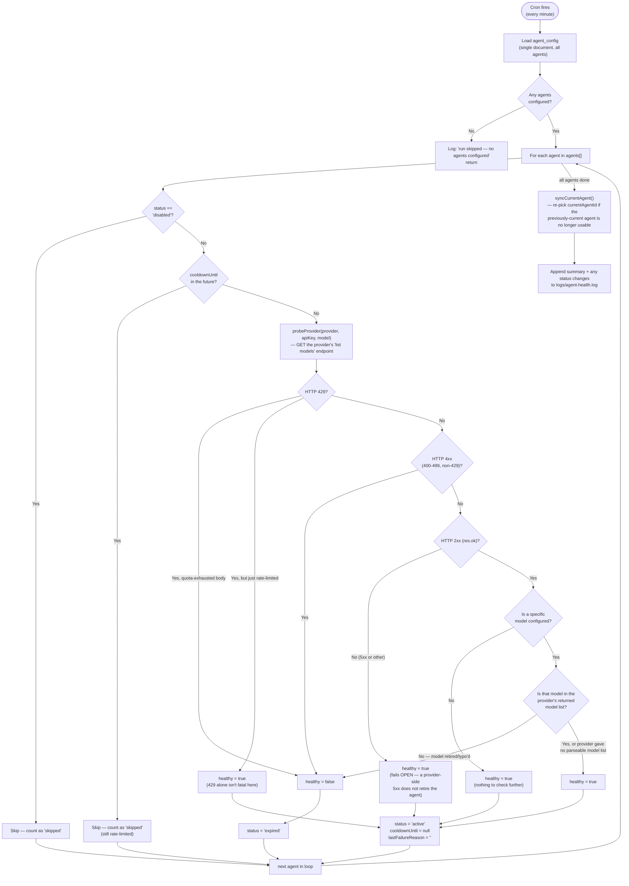

The health probe is deliberately lightweight (a provider's model-listing endpoint, not an actual completion call) — it costs no LLM tokens and takes well under the `PROBE_TIMEOUT_MS` (8s) budget, so running it every minute across an entire agent pool is cheap. Note that a network error talking to the provider (timeout, DNS failure, etc.) is treated as **healthy** (`catch { return true; }`) rather than unhealthy — the probe fails open, on the assumption that a transient network blip shouldn't retire a working agent. This means a genuinely broken agent whose failure mode is "the provider is unreachable" (rather than "the provider rejects the key/model") will not be caught by this cron job at all — it will only surface the next time a real request tries to use it and gets classified by `AnalyticsService`'s live-failure handling ([§4.6](#4-architecture)).

## 17. Logging & Observability

All application logging goes through `nest-app/src/common/logger/app.logger.ts` — a hand-rolled, colorized console logger, not a structured logging library like `pino`/`winston`:

- **`log(tag, msg, data?)`** — the primary function used throughout `ai/*.ts` and `pipeline.service.ts`. Prints `[HH:mm:ss.SSS] [requestId] [tag] message`, with the tag colorized per a fixed palette (`router`=cyan, `analytics`=blue, `supervisor-plan`=magenta, `aggregation`=yellow, `chart-agent`/`writer-agent`=green, `sources`=gray, anything else=gray). If a `data` object is passed it's pretty-printed as dimmed JSON on the following line.
- **Request correlation.** `RequestIdMiddleware` ([`common/middleware/request-id.middleware.ts`](nest-app/src/common/middleware/request-id.middleware.ts)) wraps every request in an `AsyncLocalStorage` context holding a fresh `randomUUID()`; `log()` reads that context automatically, so every line emitted anywhere during the handling of one HTTP request carries the same 8-character request ID prefix — the fastest way to `grep` one request's full trace out of the server log.
- **`logTrace(tag, msg, data?)`** — identical to `log()`, but a no-op unless the `TRACE` env var is exactly `"1"`. Used in `chart.ts` and `writer.ts` to dump the full LLM result object (`logTrace('writer:inquiry', 'result', object)`) without spamming production logs by default.
- **`AppLogger`** implements Nest's `LoggerService` interface (registered as the app's logger in `main.ts` via `app.useLogger(app.get(AppLogger))`) so framework-level `Logger.log/warn/error` calls (used by most services, e.g. `new Logger(PipelineService.name)`) are routed through the same colorized/tagged output. `AppLogger.debug()` only emits when the `DEBUG` env var is set (any truthy value); `.verbose()` is a deliberate no-op (verbose-level Nest logs are dropped entirely).
- There is currently **no log aggregation/shipping** built in (no Datadog/ELK/CloudWatch integration) beyond the one dedicated file for agent health (`nest-app/logs/agent-health.log`, [§16](#16-background-jobs)) — everything else goes to stdout only, so a production deployment needs its own log collection at the infrastructure level.

## 18. Deployment

The backend can serve the built Angular app directly, so a single NestJS process can be the whole deployment:

```powershell
# From the client/ directory — build the Angular app
cd client
npm run build            # outputs to client/dist/mind-ui/browser

# From nest-app/ — build and start the API
cd ../nest-app
npm run build             # nest build → nest-app/dist
npm run start:prod        # node dist/main
```

`AppModule` ([`app.module.ts`](nest-app/src/app.module.ts)) checks at boot whether `client/dist/mind-ui/browser/index.html` exists; if it does, it registers `ServeStaticModule` to serve the Angular bundle for every route that isn't `/api/*` or `/health`. If the Angular build is missing, the backend still runs as an API-only server — this is expected in split-deployment setups (e.g. API on one host, static frontend on a CDN).

Production checklist:
- Set `MONGODB_URI`, `API_KEY`, and `ALLOWED_ORIGINS` explicitly.
- Point `LIBSQL_URL` at a persistent volume (the default `file:./data/memory.db` is local disk — it will not survive a container redeploy unless that path is mounted).
- Configure at least one working AI connection via `PUT /api/agent-config` (shared) so the app isn't dependent on every user bringing their own key.
- `app.enableShutdownHooks()` is already wired up — NestJS will close the Mongo connection cleanly on `SIGTERM`; make sure your process manager/orchestrator sends that signal and waits up to `SHUTDOWN_TIMEOUT_MS`.
- Build the Angular app *before* starting the backend if you want single-process serving — the static-file check only runs once, at boot.
- Put a rate limiter in front of the API if it will see untrusted traffic — see [§15](#15-security-model--trust-boundaries).

## 19. Error Response Format

Every error response (validation, guards, unhandled exceptions) is normalized by `AllExceptionsFilter` ([`common/filters/all-exceptions.filter.ts`](nest-app/src/common/filters/all-exceptions.filter.ts)) to a single shape:

```jsonc
{
  "error": "Human-readable message",
  "code": "INVALID_API_KEY",       // optional — only present for a known subset of error types
  // any additional fields the throwing site attached, e.g.:
  "currentLimit": 4000,
  "suggestedLimit": 6000
}
```

Known `code` values (see `ERROR_CODES` in [`analytics/analytics.service.ts`](nest-app/src/analytics/analytics.service.ts)): `INVALID_API_KEY`, `LLM_RATE_LIMIT`, `MEMORY_TOKEN_LIMIT_TOO_LOW`, `TOKEN_LIMIT_TOO_LOW`, `INPUT_TOKEN_LIMIT_TOO_LOW`, `NO_ACTIVE_CONNECTION`. Frontend code should switch on `code` rather than parsing `error` text, since the message wording can change. See [§9.9](#9-examples--prompts-requests--responses) for a worked example.

5xx errors are logged server-side with a stack trace; 4xx errors are not (they're expected client mistakes, not bugs).

## 20. Common Workflows

**Add a new queryable dataset**
1. Make sure the MongoDB collection exists (empty is fine).
2. `POST /api/sources` with `{ name, collection, description?, fields: [{ name, type, role?, enumValues?, referenceTo? }, ...] }` — see [§9](#9-examples--prompts-requests--responses) for a full example.
3. The in-memory sources cache reloads automatically (`SourcesService.reloadCache()`); no restart needed.
4. Test with an inquiry prompt first (cheapest/fastest LLM call) before trying dashboard/report.

**Add support for a new LLM provider**
1. Add its base URL to `PROVIDERS` in [`ai/model.ts`](nest-app/src/ai/model.ts).
2. Add a case to `resolveModel()` — reuse `createOpenAI({..., fetch: openAICompatFetch})` if it's OpenAI-compatible.
3. Add its model list to `PROVIDER_MODELS` (used by `POST /api/settings/models`), or rely on `fetchProviderModels()` if it exposes a `GET /models` endpoint in an OpenAI/Anthropic/Google-shaped response.
4. If it needs special request tweaks (e.g. Groq disabling structured outputs), add a branch in `skillProviderOptions()`.

**Add or rotate a shared fallback connection**
- `PUT /api/agent-config` with the full `agents[]` array (existing entries merge by `id` or `apiKey` so runtime state like usage counters isn't lost) — this triggers an immediate health check, so a bad key shows as `expired` within seconds rather than up to a minute later.

**Change token limits after hitting a `422`**
- The error body already includes `suggestedLimit` — for a personal connection, `PATCH /api/settings/token-limit`; for a shared agent, `PATCH /api/agent-config/token-limit` with `{ agentId, field: 'input'|'output'|'memory', value }`.

**Tune prompt/system-prompt behavior**
- Edit the relevant `skills/*/SKILL.md` file (loaded via `ai/skill-prompt.ts`'s `readMarkdownSection`/`readJsonSection`) rather than inlining prompt strings in TypeScript. `skills/aggregation/SKILL.md` also holds the `Pipeline Config` JSON block (`forbiddenStages`, `stageSemantics`) that `pipeline.service.ts` and `planner.ts` both read at import time. `skills/chart/SKILL.md` holds the full ECharts authoring contract described in [§6](#6-ai-pipeline-in-detail). **Remember:** these files are read once at server boot — restart `nest-app` after editing one.

**Debug a specific request end-to-end**
- Grep the server log for the 8-character request ID printed at the start of the response (or correlate by timestamp) — every log line for that request shares the same ID via `RequestIdMiddleware` (see [§17](#17-logging--observability)). Set `TRACE=1` to also see full LLM input/output payloads for that run.

## 21. Glossary

| Term | Meaning |
|---|---|
| **Intent** | Which of the three output shapes a prompt should produce: `dashboard`, `report`, or `inquiry`. Either passed explicitly by the client or inferred from `needsData`/skills. |
| **Source** (data source) | A registered MongoDB collection + field schema that the planner is allowed to query. Not the same as a MongoDB collection itself — a source is the *description* of one. |
| **Plan** (`TaskPlan`) | The structured output of the planner LLM call: which source to query, the aggregation pipeline, and (for dashboards) a chart strategy/hint. |
| **Skill** | A `skills/*/SKILL.md` markdown file holding the system-prompt text for one LLM role (aggregation, chart, writer, inquiry, report, memory, suggestions, analytics). Loaded via `ai/skill-prompt.ts`, not hardcoded in TypeScript. Also used loosely for `TaskPlan.skills[]` (`aggregation`/`chart`/`report`/`inquiry`) — the set of execution steps a plan requires. |
| **Agent** (in `agent-config`) | A shared, pre-configured AI provider connection (API key + provider + model + limits) that requests fall back to when the calling user has no personal key. Not to be confused with the Mastra `Agent` class instantiated per-LLM-call in `ai/model.ts`. |
| **Session** | A conversation thread (`sessionId`), backed by LibSQL, holding recent user/assistant turns used as short-term memory for follow-up prompts. |
| **Memory** (long-term) | Durable, per-user facts extracted from past conversations (opt-in via `MEMORY_EXTRACTION_ENABLED` / `PATCH /api/memory/config`), retrieved and injected into future prompts. Distinct from session memory. |
| **Widget** | One chart/table entry inside a `DashboardSpec.widgets[]` — either a free-form ECharts `option` object the LLM authored, or `{ type: "table", columns, rows }`. |
| **Strategy** / **chartHint** | Planner-chosen hints (`standard`/`trend`/`comparison`/`anomaly`/`overview` and a free-form string like `ranking`/`distribution`) that steer, but don't dictate, what `ai/chart.ts` builds. |
| **Request ID** | A per-HTTP-request UUID assigned by `RequestIdMiddleware`, threaded through every log line for that request via `AsyncLocalStorage`. Not returned to the client — log-tracing only. |

## 22. Troubleshooting

| Symptom | Likely cause / fix |
|---|---|
| `/health` returns `503 { sources: 0 }` | No data sources registered yet — `POST /api/sources` with at least one dataset (see [§9](#9-examples--prompts-requests--responses)). |
| `401 NO_ACTIVE_CONNECTION` | No personal API key saved for this `x-user-id`, and no active shared agent in `agent-config` (all disabled/expired/cooling down). Add one via `/api/settings` or fix an agent via `/api/agent-config`. |
| `401 INVALID_API_KEY` | The configured key was rejected by the provider — re-validate via `POST /api/settings/validate`, or check `agent-config` for an agent stuck in `expired`. |
| `429` with a retry time | Provider rate limit hit; if using the shared agent pool this should self-heal (next agent, or cooldown expiry) — check `logs/agent-health.log`. |
| `422 TOKEN_LIMIT_TOO_LOW` / `INPUT_TOKEN_LIMIT_TOO_LOW` / `MEMORY_TOKEN_LIMIT_TOO_LOW` | Response, request, or memory context is larger than the configured limit — the error body includes `suggestedLimit`; raise it via `PATCH /api/settings/token-limit` or `PATCH /api/agent-config/token-limit`. |
| Pipeline retried once then still failed with a MongoDB error | The planner produced an invalid stage or referenced an unregistered field — check the server log for the `PipelineService` retry hint; it usually names the exact bad field/operator. |
| Dashboard response has `widgets: []` | No rows matched the filters (see [§9.8](#9-examples--prompts-requests--responses)) — broaden the prompt or check the data actually exists for that filter. |
| Angular app not served at `/` in production | `client/dist/mind-ui/browser/index.html` doesn't exist yet — run `npm run build` in `client/` before starting the backend, then restart it (the check happens once at boot). |
| Conversation memory resets after a restart/redeploy | `LIBSQL_URL` is pointing at a non-persistent path — mount `./data` as a volume, or point `LIBSQL_URL` at a durable location. |
| Long-term memory never shows up in a prompt | `MEMORY_EXTRACTION_ENABLED` (or the runtime toggle via `PATCH /api/memory/config`) is off, or the previous response summary was ≤30 characters (`MIN_SUMMARY_LENGTH_FOR_MEMORY`) so nothing was extracted. |
| Edited a `SKILL.md` file but behavior didn't change | Skill files are read once at server boot ([§6](#6-ai-pipeline-in-detail)) — restart `nest-app`. |
| Need to trace exactly what happened on one request | Find its request ID in the log output and grep for it; set `TRACE=1` for full LLM payloads — see [§17](#17-logging--observability). |

## 23. Known Limitations & Roadmap Considerations

### Feature Maturity Matrix

The fastest way to answer "is X safe to rely on?" without re-reading the whole document — every major subsystem, rated by what was actually verified in the code (not by intent or aspiration):

| Subsystem | Status | Notes |
|---|:---:|---|
| Dashboard / report / inquiry generation | ✅ Solid | Deterministic guardrails around the LLM output (sanitize, renderability check, heatmap `visualMap`, 1-retry pipeline validation) |
| MongoDB pipeline planning & validation | ✅ Solid | Field/stage validation before execution; targeted retry hints — see [§6](#6-ai-pipeline-in-detail), [§4.8](#4-architecture) |
| Prompt-result caching (7-day TTL) | ✅ Solid | Correctly bypassed on follow-up turns |
| Short-term conversation memory (LibSQL) | ✅ Solid | No horizontal-scaling story yet if `nest-app` runs multi-instance |
| Agent pool fallback + health-check cron | ✅ Solid | One real gap: probe **fails open** on network errors — see [§16](#16-background-jobs) |
| Per-user settings (BYO API key) | ✅ Solid | Key stored in plaintext — see [§15](#15-security-model--trust-boundaries) |
| API documentation (Swagger/OpenAPI) | ✅ Solid (new) | Public route by design (`/api/docs`) even behind `API_KEY` — see [§15](#15-security-model--trust-boundaries) |
| Token limit enforcement | ⚠️ Works, with caveats | Pre-flight check is a character-count *estimate*, not the provider's real tokenizer ([§6](#6-ai-pipeline-in-detail)); personal-connection usage counters are **never** auto-reset, only the shared agent pool's are |
| Long-term memory extraction & recall | ⚠️ Works, with caveats | Relevance ranking is keyword/tag overlap, not embeddings; extraction is `void`-called, not truly decoupled from the request |
| Skills system (prompt loading) | ⚠️ Works, with caveats | **3 of 8** `skills/` folders (`writer`, `analytics`, `suggestions`) are dead code — not loaded by anything, see [§6](#6-ai-pipeline-in-detail) |
| Authentication / authorization | ❌ Not implemented | `x-user-id` is an unverified namespace key, not identity — by design for now, see [§15](#15-security-model--trust-boundaries) |
| Request rate limiting | ❌ Not implemented | No middleware; only reactive per-provider backoff after a 429 |
| CI/CD pipeline | ❌ Not implemented | No `.github/workflows` found in the repo |
| Containerization | ❌ Not implemented | No `Dockerfile`/`docker-compose.yml` found in the repo |
| License | ❌ Missing | `nest-app/package.json` declares `"license": "UNLICENSED"`; no `LICENSE` file exists anywhere in the repo |
| Frontend automated testing / linting | ❌ Not implemented | `client/package.json` has no `test` or `lint` script at all (unlike the backend) |
| Horizontal scaling (multiple `nest-app` instances) | ❌ Undocumented | Single MongoDB connection assumption is fine; single-file LibSQL is not multi-instance-safe as-is |

### Detailed gap notes

A candid list of gaps found while documenting this system — useful input for prioritizing engineering work, not a criticism of the current implementation:

- **Auth is namespace-only, not identity-verified** ([§15](#15-security-model--trust-boundaries)) — the single largest gap if this is ever exposed beyond a trusted internal network.
- **No request rate limiting inside `nest-app`** — the legacy prototype had `express-rate-limit`; the current backend does not. Combined with provider API keys being reusable across any caller who knows a valid `x-user-id`, an internal actor could run up API costs faster than the token-limit guards alone would catch (those guards check *response size*, not *request frequency*).
- **Long-term memory relevance is keyword/tag overlap, not embeddings** ([§7](#7-data-model--mongodb-collections)) — works for small memory sets but will degrade in relevance-ranking quality as a user's memory count grows past what a keyword match can meaningfully rank.
- **No hot-reload for skill prompts** — every `skills/*/SKILL.md` edit requires a restart ([§6](#6-ai-pipeline-in-detail)); there's no admin UI or endpoint to preview a prompt change before restarting.
- **Memory extraction is fire-and-forget but not truly decoupled from the request** — `AnalyticsService.maybeExtractMemory()` is invoked with `void` (not awaited by the caller), but it still runs as part of the same Node.js event loop turn triggered by the request; a slow or hanging memory-extraction call doesn't block the HTTP response but does still consume a concurrent LLM connection slot.
- **Logging has no shipping/aggregation built in** ([§17](#17-logging--observability)) — fine for local dev, but a multi-instance production deployment needs its own centralized log collection since everything goes to stdout.
- **No pagination cap enforcement on some list endpoints** — e.g. `GET /api/memory` and `GET /api/saved` default to fixed limits (50/100 respectively) with no client-provided pagination at all, unlike `/api/history/results` which supports `skip`/`limit`.
- **Test coverage is uneven** — the AI orchestration core (`pipeline.service`, `analytics.service`, `planner`, `writer`, `model`) is well covered; `ai/chart.ts`, `memory/memory.service.ts`, `cache/cache.service.ts`, `history/history.service.ts`, `saved-results/*`, and `agent-config/agent-health.service.ts` currently have no dedicated spec files ([§14](#14-testing)).
- **Single MongoDB connection, single LibSQL file** — there's no documented story for horizontally scaling `nest-app` behind a load balancer while keeping LibSQL-backed session memory consistent across instances (each instance would need to share the same `LIBSQL_URL`, and SQLite has real concurrent-writer limitations under sustained multi-instance load).
- **Three of eight `skills/` folders are dead code** (`writer`, `analytics`, `suggestions` — see [§6](#6-ai-pipeline-in-detail)) — either wire them into an actual `skillFile()` call or delete them; leaving them in place invites a future edit that silently does nothing.
- **Personal-connection token usage is permanent and unresettable** — `user_settings.inputTokensUsed`/`outputTokensUsed` only ever increase; the monthly reset cron ([§16](#16-background-jobs)) only touches the shared `agent_config` pool. The only way to zero a personal connection's counters today is `DELETE /api/settings` followed by re-saving it.
- **No CI pipeline and no containerization** — no `.github/workflows`, `Dockerfile`, or `docker-compose.yml` exist anywhere in the repository. Every build/lint/test run documented in this README ([§14](#14-testing)) is currently a manual, local action; nothing runs automatically on push or PR.
- **No LICENSE file** — `nest-app/package.json` declares `"license": "UNLICENSED"` but no `LICENSE` file exists at the repo root or inside `nest-app/`, leaving the actual terms undocumented for anyone outside the immediate team.
- **The frontend has no automated tests or linting at all** — `client/package.json` only defines `start`/`build`/`watch`; there is no `ng test` (Karma/Jasmine) or `ng lint` script, unlike the backend's full Jest suite ([§14](#14-testing)).

## 24. Contributing

- **All backend changes go in `nest-app/`.** The root `src/` folder is a legacy prototype — do not add features there.
- Match existing module conventions: a Nest module per feature area with `*.controller.ts` / `*.service.ts` / `*.repository.ts`, DTOs validated with `class-validator`, and a colocated `*.spec.ts` for service logic.
- Run `npm run lint` and `npm run test` in `nest-app/` before opening a PR; `npm run format` (Prettier) keeps diffs clean.
- If you change planner/chart/writer prompt behavior, edit the relevant `skills/*/SKILL.md` file rather than inlining prompt strings in TypeScript — that's the pattern `ai/skill-prompt.ts` expects, and remember it requires a restart to take effect.
- Keep `README.md` (this file) in sync when you add a module, route, or env var — it's the primary onboarding doc for the team.
